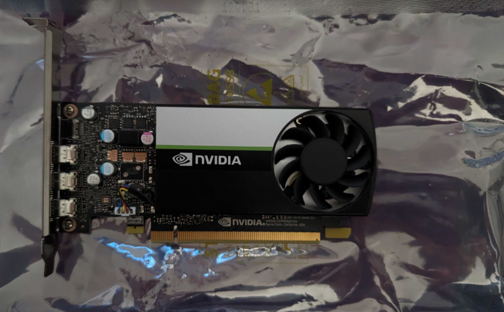
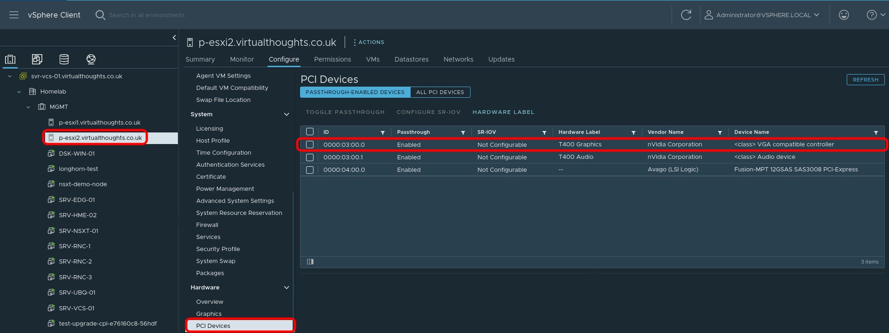
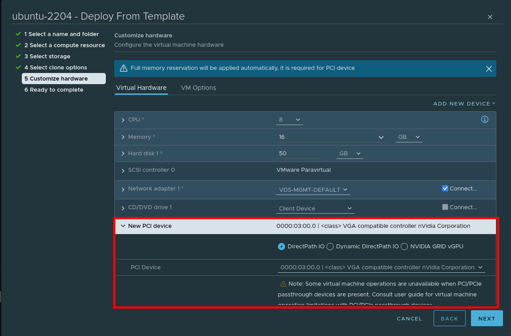
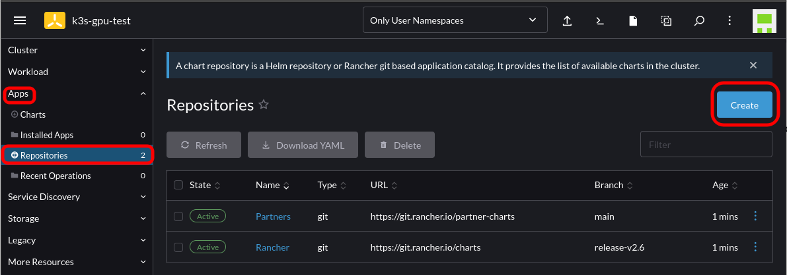
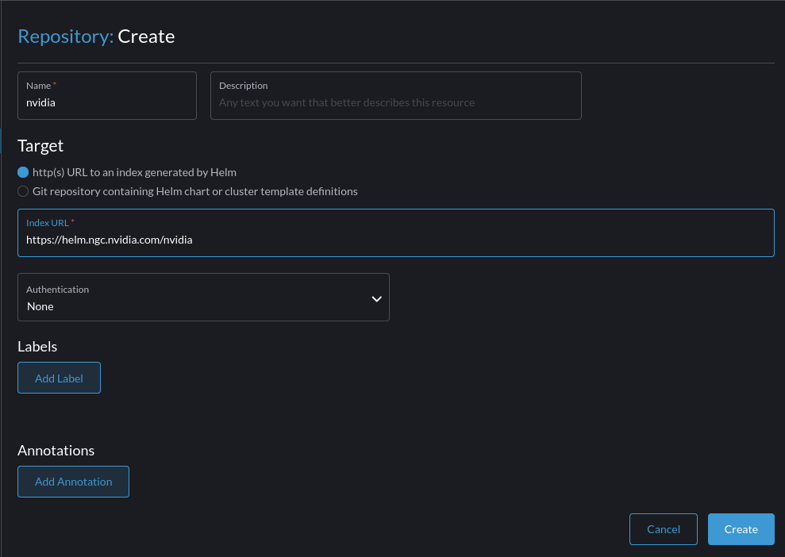
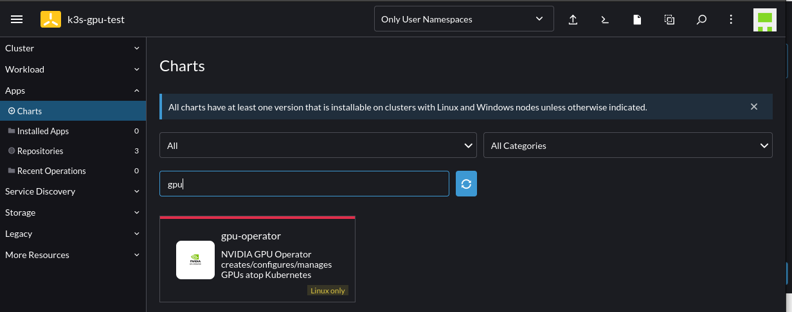
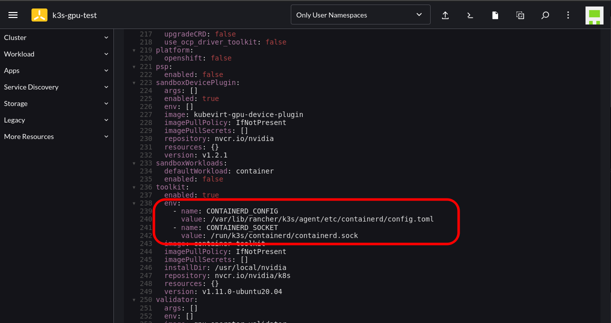

This post outlines the necessary steps to leverage the Nvidia GPU operator in a K3s cluster. In this example, using a gift from me to my homelab, a cheap Nvidia T400 GPU which is on the supported list for the operator.



## Step 1 - Configure Passthrough (If required)

For this environment, vSphere is used and therefore PCI Passthrough is required to present the GPU to the VM. The Nvidia GPU is represented as two devices - one for the video controller, and another for the audio controller - we only need the video controller. Steps after this are still relevant to bare metal deployments.



## Step 2 - Create VM

When creating a VM, choose to add a PCI device, and specify the Nvidia GPU:



## Step 3 - Install `nvidia-container-runtime` and K3s

In order for Containerd (within K3s) to pick up the Nvidia plugin when K3s starts, we need to install the corresponding container runtime:

```
root@ubuntu:~# curl -s -L https://nvidia.github.io/nvidia-container-runtime/gpgkey |   sudo apt-key add -
root@ubuntu:~# distribution=$(. /etc/os-release;echo $ID$VERSION_ID)
root@ubuntu:~# curl -s -L https://nvidia.github.io/nvidia-container-runtime/$distribution/nvidia-container-runtime.list |   sudo tee /etc/apt/sources.list.d/nvidia-container-runtime.list
root@ubuntu:~# apt update && apt install -y nvidia-container-runtime

root@ubuntu:~# curl -sfL https://get.k3s.io | INSTALL_K3S_VERSION="v1.23.7+k3s1" sh
```

We can validate the Containerd config includes the Nvidia plugin with:

```
root@ubuntu:~# cat /var/lib/rancher/k3s/agent/etc/containerd/config.toml | grep -i nvidia
[plugins.cri.containerd.runtimes."nvidia"]
[plugins.cri.containerd.runtimes."nvidia".options]
  BinaryName = "/usr/bin/nvidia-container-runtime"
```

## Step 4 - Import Cluster into Rancher and install the `nvidia-gpu-operator`

Follow [this](https://docs.ranchermanager.rancher.io/how-to-guides/new-user-guides/kubernetes-clusters-in-rancher-setup/register-existing-clusters) guide to import an existing cluster in Rancher.

After which, Navigate to `Rancher -> Cluster -> Apps -> Repositories -> Create`



Add the Helm chart for the Nvidia GPU operator:



Select to install the GPU Operator chart by going to `Cluster -> Apps -> Charts -> Search for "GPU"`:



Follow the instructions until you reach the `Edit YAML` section. At this point add the following configuration into the corresponding section; this is to cater to where K3s stores the Containerd config and socket endpoint:

```
toolkit:
  env:
    - name: CONTAINERD_CONFIG
      value: /var/lib/rancher/k3s/agent/etc/containerd/config.toml
    - name: CONTAINERD_SOCKET
      value: /run/k3s/containerd/containerd.sock
```



Proceed with the installation and wait for the corresponding Pods to spin up. This will take some time as it's compiling the GPU/CUDA drivers on the fly.

**Note:** You will notice several GPU-Operator Pods initially in a crashloop state. This is expected until the nvidia-driver-daemonset Pod has finished building and installing the Nvidia drivers. You can follow the Pod logs to get more insight as to what's occurring.

```
oot@ubuntu:~# kubectl logs nvidia-driver-daemonset-wmrxq
DRIVER_ARCH is x86_64
Creating directory NVIDIA-Linux-x86_64-515.65.01
Verifying archive integrity... OK
root@ubuntu:~# kubectl logs nvidia-driver-daemonset-wmrxq -f
DRIVER_ARCH is x86_64
Creating directory NVIDIA-Linux-x86_64-515.65.01
Verifying archive integrity... OK
Uncompressing NVIDIA Accelerated Graphics Driver for Linux-x86_64 515.65.01............................................................................................................................................
```

```
root@ubuntu:~# kubectl get po
NAME                                                              READY   STATUS            RESTARTS      AGE
nvidia-dcgm-exporter-dkcz9                                        0/1     PodInitializing   0             4m42s
gpu-operator-v22-1669053133-node-feature-discovery-master-t4mrp   1/1     Running           0             6m26s
gpu-operator-v22-1669053133-node-feature-discovery-worker-rxxw5   1/1     Running           1 (91s ago)   6m1s
gpu-operator-8488c86579-gf7z8                                     1/1     Running           1 (10m ago)   30m
nvidia-container-toolkit-daemonset-mgn92                          1/1     Running           0             5m59s
nvidia-driver-daemonset-46sdp                                     1/1     Running           0             5m55s
nvidia-cuda-validator-cmt7x                                       0/1     Completed         0             74s
gpu-feature-discovery-4xw2q                                       1/1     Running           0             4m23s
nvidia-device-plugin-daemonset-8czgl                              1/1     Running           0             5m
nvidia-device-plugin-validator-tzpq8                              0/1     Completed         0             37s
```

## Step 5 - Validate and Test

First, check to see the `runtimeClass` is present:

```
root@ubuntu:~# kubectl get runtimeclass
NAME     HANDLER   AGE
nvidia   nvidia    30m
```

`kubectl describe node` should also list a GPU under the `Allocatable` resources:

```
Allocatable:
  cpu:                8
  ephemeral-storage:  49893476109
  hugepages-1Gi:      0
  hugepages-2Mi:      0
  memory:             16384596Ki
  nvidia.com/gpu:     1
```

We can use the following workload to test. Note the `runtimeClassName` reference in the Pod spec:

```
 cat << EOF | kubectl create -f -
apiVersion: v1
kind: Pod
metadata:
  name: cuda-vectoradd
spec:
  restartPolicy: OnFailure
  runtimeClassName: nvidia
  containers:
  - name: cuda-vectoradd
    image: "nvidia/samples:vectoradd-cuda11.2.1"
    resources:
      limits:
         nvidia.com/gpu: 1
EOF
```

Logs from the Pod will indicate if it was successful:

```
root@ubuntu:~# kubectl logs cuda-vectoradd
[Vector addition of 50000 elements]
Copy input data from the host memory to the CUDA device
CUDA kernel launch with 196 blocks of 256 threads
Copy output data from the CUDA device to the host memory
Test PASSED
```

Without providing the `runtimeClassName` in the spec the Pod will error:

```
root@ubuntu:~# kubectl logs cuda-vectoradd
[Vector addition of 50000 elements]
Failed to allocate device vector A (error code CUDA driver version is insufficient for CUDA runtime version)!
```
