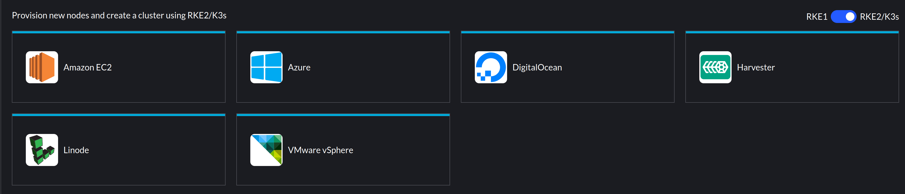
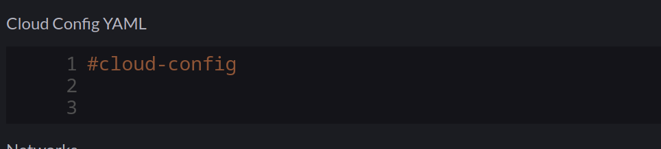
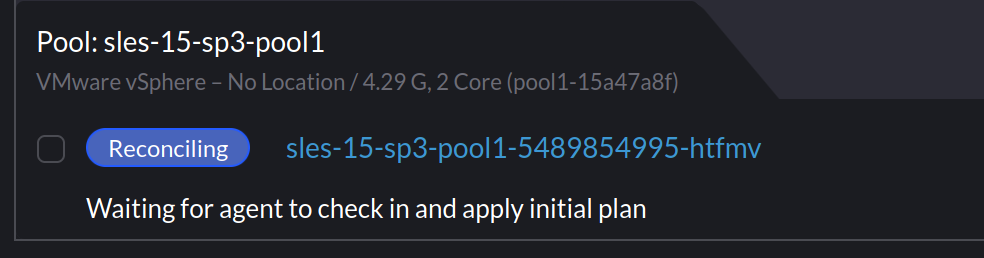
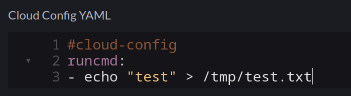

## Background

Rancher leverages cloud-init for the provisioning of Virtual Machines on a number of infrastructure providers, as below:



I recently encountered an issue whereby vSphere based clusters using an Ubuntu VM template would successfully provision, but SLES based VM templates would not.

## What does Rancher use cloud-init for?

This is covered in the [Masterclass](https://www.youtube.com/watch?v=ozLPpyrqwf8) session I co-hosted, but as a refresher, particularly with the `vSphere` driver, Rancher will mount an ISO image to the VM to deliver the `user-data` portion of a `cloud-init` configuration. The contents of which look like this:

```yaml
#cloud-config
groups:
- staff
hostname: scale-aio-472516f5-s82pz
runcmd:
- sh /usr/local/custom_script/install.sh
set_hostname:
- scale-aio-472516f5-s82pz
users:
- create_groups: false
  groups: staff
  lock_passwd: true
  name: docker
  no_user_group: true
  ssh_authorized_keys:
  - |
    ssh-rsa AAAAB3NzaC1yc.......
  sudo: ALL=(ALL) NOPASSWD:ALL
write_files:
- content: H4sIAAAAAAAA/wAAA...........
  encoding: gzip+b64
  path: /usr/local/custom_script/install.sh
  permissions: "0644"
```

Note: This is automatically generated, any additional cloud-init config you include in the cluster configuration (below) gets merged with the above.



It saves a script with `write_files` and then runs this with `runcmd` - this will install the `rancher-system-agent` service and begin the process of installing RKE2/K3s.

## The Issue

When I provisioned SLES based clusters using my existing [Packer template](https://github.com/David-VTUK/Rancher-Packer), Rancher would indicate it was waiting for the agent to check in:



## Investigating

Thinking cloud-init didn't ingest the config, I ssh'd into the node to do some debugging. I noticed that the node name had changed:

```bash
sles-15-sp3-pool1-15a47a8f-xcspb:~ #
```

Which I verified with:

```bash
sles-15-sp3-pool1-15a47a8f-xcspb:/ # cat /var/lib/cloud/instance/user-data.txt | grep hostname
hostname: sles-15-sp3-pool1-15a47a8f-xcspb
```

Inspecting `user-data.txt` from that directory also matched what was in the mounted ISO. I could also see `/usr/local/custom_script/install.sh` was created, but nothing indicated that it was executed. It appeared everything else from the cloud-init file was processed - SSH keys, groups, writing the script, etc, but nothing from `runcmd` was executed.

I ruled out the script by creating a new cluster and adding my own command:



As expected, this was merged into the `user-data.iso` file mounted to the VM, but `/tmp/test.txt` didn't exist, so it was never executed.

## Checking cloud-init logs

`Cloud-Init` has an easy way to collect logs - the `cloud-init collect-logs` command, This will generate a tarball:

```bash
sles-15-sp3-pool1-15a47a8f-xcspb:/ # cloud-init collect-logs
Wrote /cloud-init.tar.gz
```

I noted in `cloud-init.log` I could see the script file being saved:

```bash
2023-01-18 09:56:22,917 - helpers.py[DEBUG]: Running config-write-files using lock (<FileLock using file '/var/lib/cloud/instances/nocloud/sem/config_write_files'>)
2023-01-18 09:56:22,927 - util.py[DEBUG]: Writing to /usr/local/custom_script/install.sh - wb: [644] 29800 bytes
2023-01-18 09:56:22,928 - util.py[DEBUG]: Changing the ownership of /usr/local/custom_script/install.sh to 0:0
```

But nothing indicating it was executed.

I decided to extrapolate a list of all the cloud-init modules that were initiated:

```bash
cat cloud-init.log | grep "Running module"

stages.py[DEBUG]: Running module migrator
stages.py[DEBUG]: Running module seed_random 
stages.py[DEBUG]: Running module bootcmd 
stages.py[DEBUG]: Running module write-files 
stages.py[DEBUG]: Running module growpart 
stages.py[DEBUG]: Running module resizefs 
stages.py[DEBUG]: Running module disk_setup
stages.py[DEBUG]: Running module mounts 
stages.py[DEBUG]: Running module set_hostname
stages.py[DEBUG]: Running module update_hostname 
stages.py[DEBUG]: Running module update_etc_hosts 
stages.py[DEBUG]: Running module rsyslog 
stages.py[DEBUG]: Running module users-groups 
stages.py[DEBUG]: Running module ssh
```

But still, no sign of `runcmd`.

## Checking cloud-init configuration

Outside of the log bundle, `/etc/cloud/cloud.cfg` includes the configuration for cloud-init. having suspected the `runcmd` module may not be loaded, I checked, but it was present:

```yaml
# The modules that run in the 'config' stage
cloud_config_modules:
 - ssh-import-id
 - locale
 - set-passwords
 - zypper-add-repo
 - ntp
 - timezone
 - disable-ec2-metadata
 - runcmd
```

However, I noticed that nothing from the `cloud_config_modules` block was mentioned in `cloud-init.log`. However, everything from `cloud_init_modules` was:

```yaml
# The modules that run in the 'init' stage
cloud_init_modules:
 - migrator
 - seed_random
 - bootcmd
 - write-files
 - growpart
 - resizefs
 - disk_setup
 - mounts
 - set_hostname
 - update_hostname
 - update_etc_hosts
 - ca-certs
 - rsyslog
 - users-groups
 - ssh
```

So, it appeared the entire `cloud_config_modules` **_step_** wasn't running. Weird.

## Fixing

After speaking with someone from the cloud-init community, I found out that there are several cloud-init services that exist on a host machine. Each dedicated to a specific step.

Default config on SLES 15 SP4 machine:

```bash
sles-15-sp3-pool1-15a47a8f-xcspb:/ # sudo systemctl list-unit-files | grep cloud
cloud-config.service                    disabled        disabled     
cloud-final.service                     disabled        disabled     
cloud-init-local.service                disabled        disabled     
cloud-init.service                      enabled         disabled     
cloud-config.target                     static          - 
cloud-init.target                       enabled-runtime disabled
```

Default config on a Ubuntu 22.04 machine:

```bash
packerbuilt@SRV-RNC-1:~$ sudo systemctl list-unit-files | grep cloud
cloud-config.service                        enabled         enabled
cloud-final.service                         enabled         enabled
cloud-init-hotplugd.service                 static          -
cloud-init-local.service                    enabled         enabled
cloud-init.service                          enabled         enabled
cloud-init-hotplugd.socket                  enabled         enabled
cloud-config.target                         static          -
cloud-init.target                           enabled-runtime enabled
```

The `cloud-config` service was not enabled and therefore would not run any of the related modules. To rectify, I added the following to my Packer script when building the template:

```bash
# Ensure cloud-init services are enabled
systemctl enable cloud-init.service
systemctl enable cloud-init-local.server
systemctl enable cloud-config.service
systemctl enable cloud-final.service
```

After which, provisioning SLES based machines from Rancher worked.
