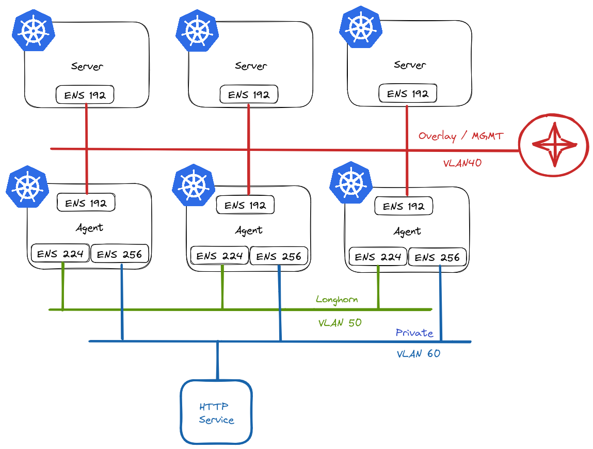
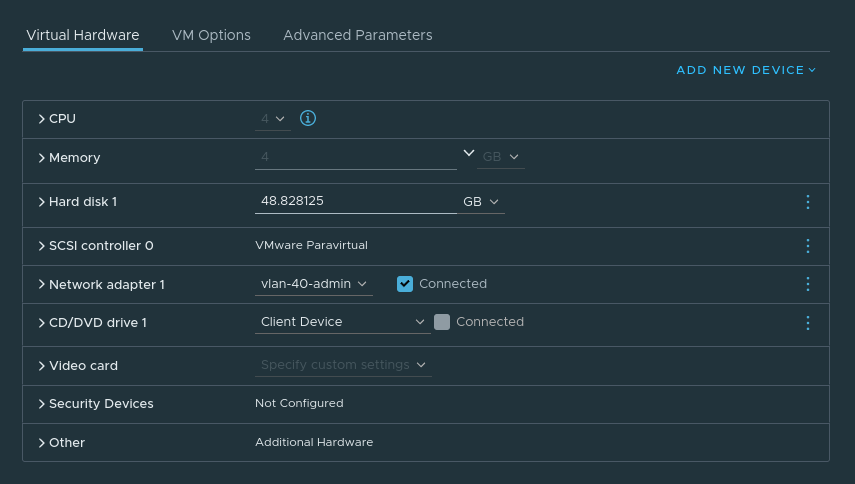
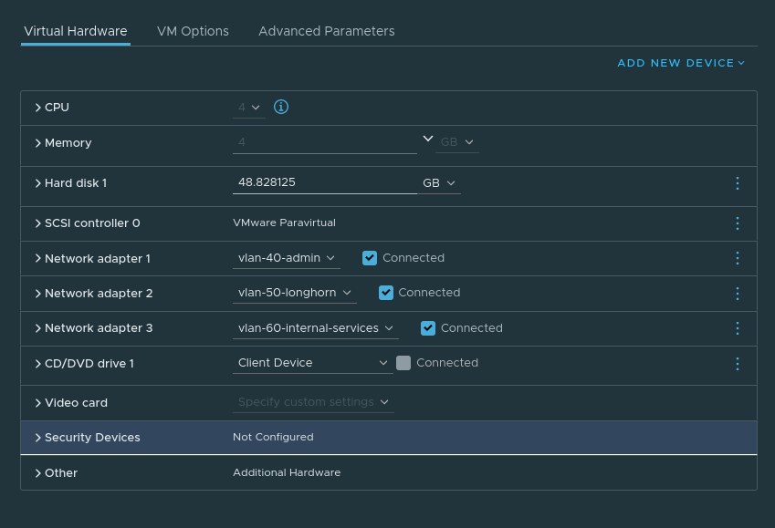
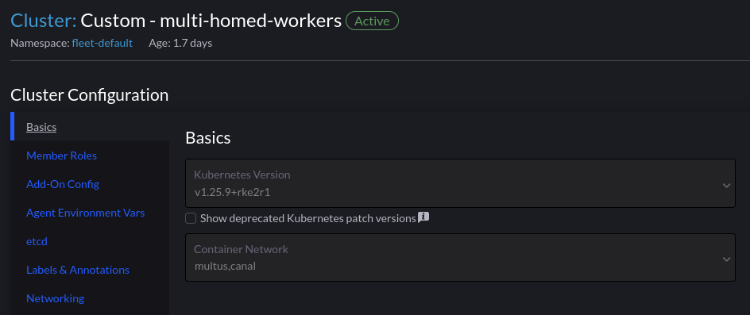
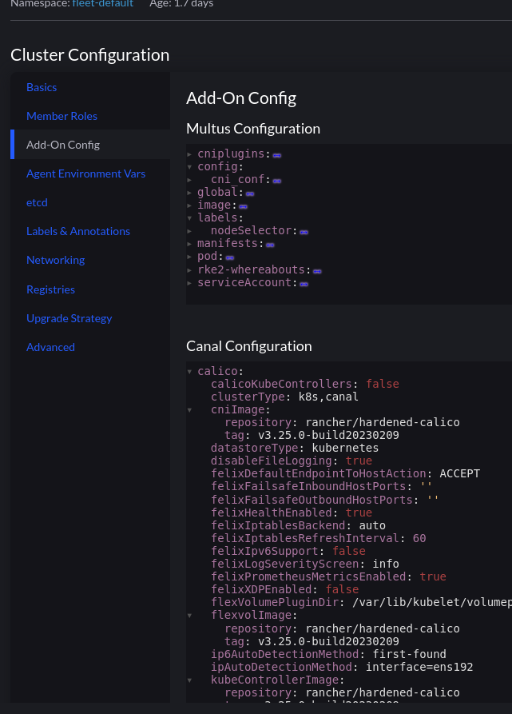
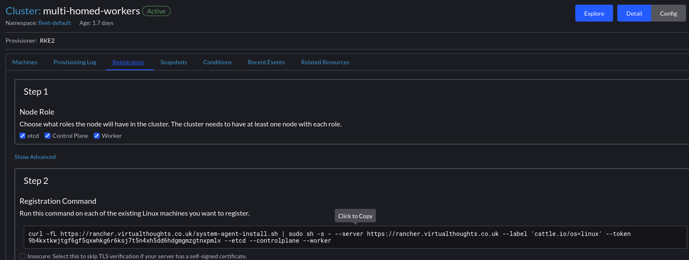
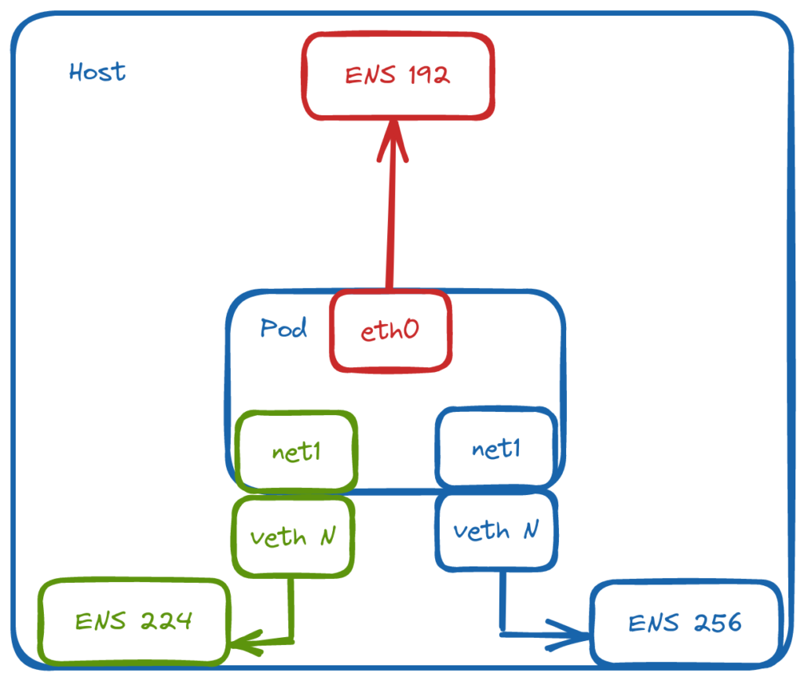
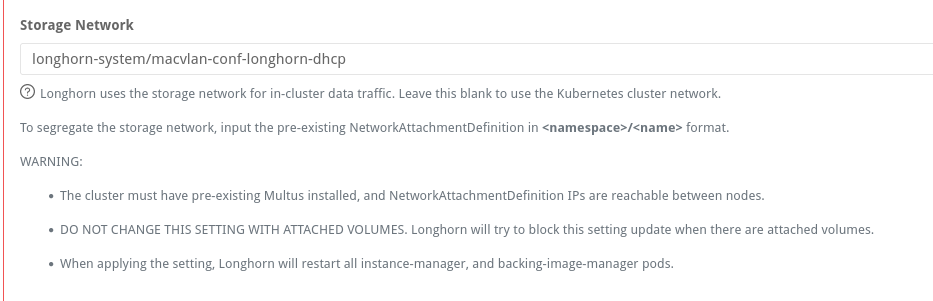

From my experience, some environments necessitate leveraging multiple NICs on Kubernetes worker nodes as well as the underlying Pods. Because of this, I wanted to create a test environment to experiment with this kind of setup. Although more common in bare metal environments, I'll create a virtualised equivalent.

## Planning

This is what I have in mind:



In RKE2 vernacular, we refer to nodes that assume etcd and/or control plane roles as `servers`, and worker nodes as `agents`.

### Server Nodes

Server nodes will not run any workloads. Therefore, they only require 1 NIC. This will reside on VLAN40 in my environment and will act as the overlay/management network for my cluster and will be used for `node <-> node` communication.

### Agent Nodes

Agent nodes will be connected to multiple networks:

- **VLAN40** \- Used for `node <-> node` communication.
- **VLAN50** - Used exclusively by [Longhorn](https://longhorn.io/) for replication traffic. Longhorn is a cloud-native distributed block storage solution for Kubernetes.
- **VLAN60** - Provide access to ancillary services.

## Creating Nodes

For the purposes of experimenting, I will create my VMs first.

Server VM config:



Agent VM Config:



## Rancher Cluster Configuration

Using Multus is as simple as selecting it from the dropdown list of CNI's. We have to have an existing CNI for cluster networking, which is Canal in this example



The section "Add-On Config" enables us to make changes to the various addons for our cluster:



This cluster has the following tweaks:

```yaml
calico:
  ipAutoDetectionMethod: interface=ens192

flannel:
  backend: host-gw
  iface: ens192
```

The `Canal` CNI is a combination of both `Calico` and `Flannel`. Which is why the specific interface used is defined in both sections.

With this set, we can extract the join command and run it on our servers:

**Tip** - Store the desired node-ip in a config file before launching the command on the nodes. Ie:

```
packerbuilt@mullti-homed-wrk-1:/$ cat /etc/rancher/rke2/config.yaml
node-ip: 172.16.40.47
```



```
NAME                 STATUS   ROLES                       AGE   VERSION          INTERNAL-IP    EXTERNAL-IP   OS-IMAGE             KERNEL-VERSION      CONTAINER-RUNTIME
multi-homed-cpl-1   Ready    control-plane,etcd,master   42h   v1.25.9+rke2r1   172.16.40.46   <none>        Ubuntu 22.04.1 LTS   5.15.0-71-generic   containerd://1.6.19-k3s1
multi-homed-cpl-2   Ready    control-plane,etcd,master   41h   v1.25.9+rke2r1   172.16.40.49   <none>        Ubuntu 22.04.1 LTS   5.15.0-71-generic   containerd://1.6.19-k3s1
multi-homed-cpl-3   Ready    control-plane,etcd,master   41h   v1.25.9+rke2r1   172.16.40.50   <none>        Ubuntu 22.04.1 LTS   5.15.0-71-generic   containerd://1.6.19-k3s1
multi-homed-wrk-1   Ready    worker                      42h   v1.25.9+rke2r1   172.16.40.47   <none>        Ubuntu 22.04.1 LTS   5.15.0-71-generic   containerd://1.6.19-k3s1
multi-homed-wrk-2   Ready    worker                      42h   v1.25.9+rke2r1   172.16.40.48   <none>        Ubuntu 22.04.1 LTS   5.15.0-71-generic   containerd://1.6.19-k3s1
multi-homed-wrk-3   Ready    worker                      25h   v1.25.9+rke2r1   172.16.40.51   <none>        Ubuntu 22.04.1 LTS   5.15.0-71-generic   containerd://1.6.19-k3s1
```

## Pod Networking

Multus is not a CNI in itself, but a meta CNI plugin, enabling the use of multiple CNI's in a Kubernetes cluster. At this point we have a functioning cluster with an overlay network in place for cluster communication, and every Pod will have a interface on that network. So which other CNI's can we use?

Out of the box, we can query the /opt/cni/bin directory for available plugins. You can also add additional CNI's if you wish.

```bash
packerbuilt@mullti-homed-wrk-1:/$ ls /opt/cni/bin/
bandwidth  calico       dhcp      flannel      host-local  ipvlan    macvlan  portmap  sbr     tuning  vrf
bridge     calico-ipam  firewall  host-device  install     loopback  multus   ptp      static  vlan
```

For this environment, `macvlan` will be used. It provides MAC addresses directly to Pod interfaces which makes it simple to integrate with network services like DHCP.



## Defining the Networks

Through `NetworkAttachmentDefinition` objects, we can define the respective networks and bridge them to named, physical interfaces on the host:

```yaml
apiVersion: v1
kind: Namespace
metadata:
  name: multus-network-attachments
---
apiVersion: "k8s.cni.cncf.io/v1"
kind: NetworkAttachmentDefinition
metadata:
  name: macvlan-longhorn-dhcp
  namespace: multus-network-attachments
spec:
  config: '{
      "cniVersion": "0.3.0",
      "type": "macvlan",
      "master": "ens224",
      "mode": "bridge",
      "ipam": {
        "type": "dhcp"
      }
    }'
---
apiVersion: "k8s.cni.cncf.io/v1"
kind: NetworkAttachmentDefinition
metadata:
  name: macvlan-private-dhcp
  namespace: multus-network-attachments
spec:
  config: '{
      "cniVersion": "0.3.0",
      "type": "macvlan",
      "master": "ens256",
      "mode": "bridge",
      "ipam": {
        "type": "dhcp"
      }
    }'

```

We use an annotation to attach a pod to additional networks

```yaml
apiVersion: v1
kind: Pod
metadata:
  name: net-tools
  namespace: multus-network-attachments
  annotations:
    k8s.v1.cni.cncf.io/networks: multus-network-attachments/macvlan-longhorn-dhcp,multus-network-attachments/macvlan-private-dhcp
spec:
  containers:
  - name: samplepod
    command: ["/bin/bash", "-c", "sleep 2000000000000"]
    image: ubuntu

```

Which we can validate within the pod:

```bash
root@net-tools:/# ip addr show
3: eth0@if2: <BROADCAST,MULTICAST,UP,LOWER_UP> mtu 1450 qdisc noqueue state UP group default 
    link/ether 1a:57:1a:c1:bf:f3 brd ff:ff:ff:ff:ff:ff link-netnsid 0
    inet 10.42.5.27/32 scope global eth0
       valid_lft forever preferred_lft forever
    inet6 fe80::1857:1aff:fec1:bff3/64 scope link 
       valid_lft forever preferred_lft forever
4: net1@if4: <BROADCAST,MULTICAST,UP,LOWER_UP> mtu 1500 qdisc noqueue state UP group default 
    link/ether aa:70:ab:b6:7a:86 brd ff:ff:ff:ff:ff:ff link-netnsid 0
    inet 172.16.50.40/24 brd 172.16.50.255 scope global net1
       valid_lft forever preferred_lft forever
    inet6 fe80::a870:abff:feb6:7a86/64 scope link 
       valid_lft forever preferred_lft forever
5: net2@if5: <BROADCAST,MULTICAST,UP,LOWER_UP> mtu 1500 qdisc noqueue state UP group default 
    link/ether 62:a6:51:84:a9:30 brd ff:ff:ff:ff:ff:ff link-netnsid 0
    inet 172.16.60.30/24 brd 172.16.60.255 scope global net2
       valid_lft forever preferred_lft forever
    inet6 fe80::60a6:51ff:fe84:a930/64 scope link 
       valid_lft forever preferred_lft forever
```

```
root@net-tools:/# ip route
default via 169.254.1.1 dev eth0 
169.254.1.1 dev eth0 scope link 
172.16.50.0/24 dev net1 proto kernel scope link src 172.16.50.40 
172.16.60.0/24 dev net2 proto kernel scope link src 172.16.60.30
```

Testing access to a service on `net2`:

```
root@net-tools:/# curl 172.16.60.31
<!DOCTYPE html>
<html>
<head>
<title>Welcome to nginx!</title>

```

## Configuring Longhorn

Longhorn has a config setting to define the network used for storage operations:



If setting this post-install, the `instance-manager` pods will restart and attach a new interface:

```
instance-manager-e-437ba600ca8a15720f049790071aac70:/ # ip addr show
1: lo: <LOOPBACK,UP,LOWER_UP> mtu 65536 qdisc noqueue state UNKNOWN group default qlen 1000
    link/loopback 00:00:00:00:00:00 brd 00:00:00:00:00:00
    inet 127.0.0.1/8 scope host lo
       valid_lft forever preferred_lft forever
    inet6 ::1/128 scope host 
       valid_lft forever preferred_lft forever
3: eth0@if51: <BROADCAST,MULTICAST,UP,LOWER_UP> mtu 1450 qdisc noqueue state UP group default 
    link/ether fe:da:f1:04:81:67 brd ff:ff:ff:ff:ff:ff link-netnsid 0
    inet 10.42.1.58/32 scope global eth0
       valid_lft forever preferred_lft forever
    inet6 fe80::fcda:f1ff:fe04:8167/64 scope link 
       valid_lft forever preferred_lft forever
4: lhnet1@if4: <BROADCAST,MULTICAST,UP,LOWER_UP> mtu 1500 qdisc noqueue state UP group default 
    link/ether 12:90:50:15:04:c7 brd ff:ff:ff:ff:ff:ff link-netnsid 0
    inet 172.16.50.34/24 brd 172.16.50.255 scope global lhnet1
       valid_lft forever preferred_lft forever
    inet6 fe80::1090:50ff:fe15:4c7/64 scope link 
       valid_lft forever preferred_lft forever
```
