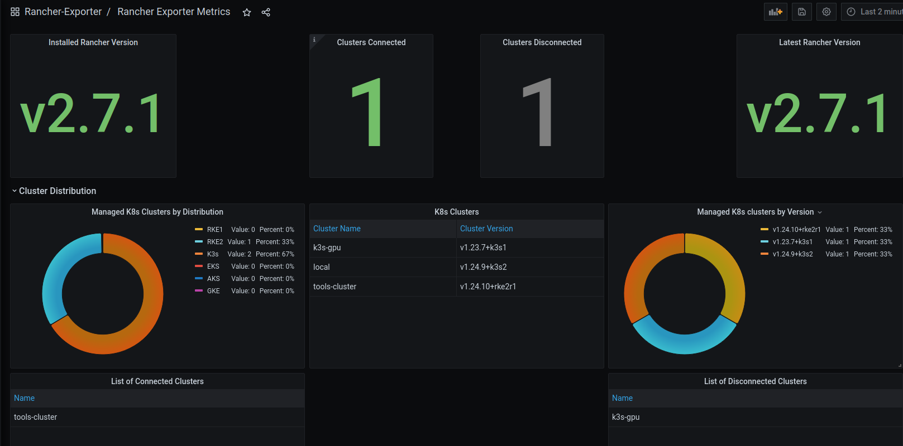
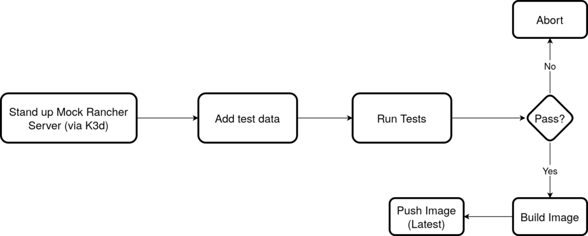
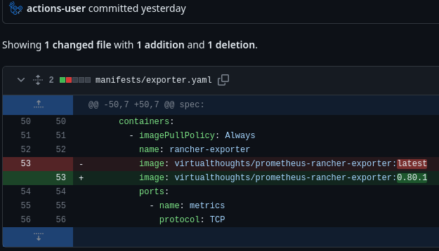

One of my side projects is developing and maintaining an [unofficial Prometheus Exporter for Rancher](https://github.com/David-VTUK/prometheus-rancher-exporter). It exposes metrics pertaining to Rancher-specific resources including, but not limited to managed clusters, Kubernetes versions, and more. Below shows an example dashboard based on these metrics.



Incidentally, if you are using Rancher, I'd love to hear your thoughts/feedback.

## Previous CI workflow

The flowchart below outlines the existing process. Whilst automated, pushing directly to `latest` is bad practice.



To improve this. Several additional steps were added. First of which acquires the latest, versioned image of the exporter and saves it to the `$GITHUB_OUTPUT` environment

```yaml
    - name: Retrieve latest Docker image version
        id: get_version
        run: |
          echo "image_version=$(curl -s "https://registry.hub.docker.com/v2/repositories/virtualthoughts/prometheus-rancher-exporter/tags/" | jq -r '.results[].name' | grep -v latest | sort -V | tail -n 1)" >> $GITHUB_OUTPUT

```

Referencing this, the next version can be generated based on `MAJOR.MINOR.PATCH`. Incrementing the `PATCH` version. In the future, this will be modified to add more flexibility to change `MAJOR` and `MINOR` versions.

```yaml
      - name: Increment version
        id: increment_version
        run: |
          # Increment the retrieved version
          echo "updated_version=$(echo "${{ steps.get_version.outputs.image_version }}" | awk -F. -v OFS=. '{$NF++;print}')" >> $GITHUB_OUTPUT
```

With the version generated, the subsequent step can tag and push both the incremented version, and latest.

```yaml
      - name: Build and push
        uses: docker/build-push-action@v3
        with:
          context: .
          push: true
          tags: |
            virtualthoughts/prometheus-rancher-exporter:${{ steps.increment_version.outputs.updated_version }}
            virtualthoughts/prometheus-rancher-exporter:latest
```

Lastly, the Github action will also modify the YAML manifest file to reference the most recent, versioned image:

```
      - name: Update Kubernetes YAML manifest
        run: |
          # Install yq
          curl -sL https://github.com/mikefarah/yq/releases/latest/download/yq_linux_amd64 -o yq
          chmod +x yq
          sudo mv yq /usr/local/bin/
          
          # Find and update the image tag in the YAML file
          IMAGE_NAME="virtualthoughts/prometheus-rancher-exporter"
          NEW_TAG="${{ steps.increment_version.outputs.updated_version }}"
          OLD_TAG=$(yq eval '.spec.template.spec.containers[] | select(.name == "rancher-exporter").image' manifests/exporter.yaml | cut -d":" -f2)
          NEW_IMAGE="${IMAGE_NAME}:${NEW_TAG}"
          sed -i "s|${IMAGE_NAME}:${OLD_TAG}|${NEW_IMAGE}|" manifests/exporter.yaml
```

Which results in:


