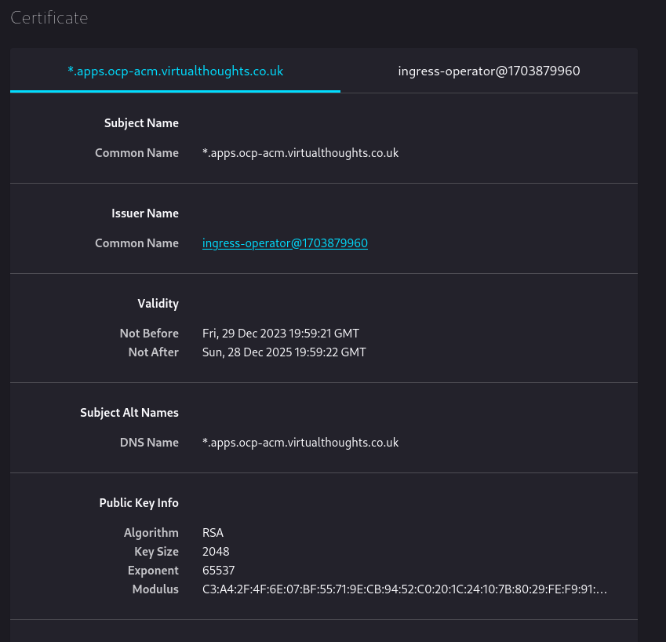
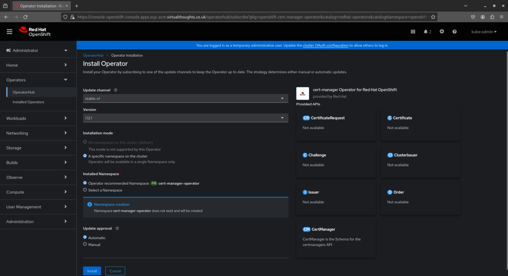
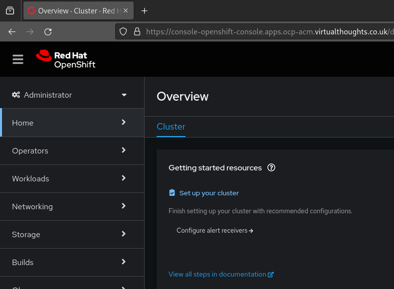
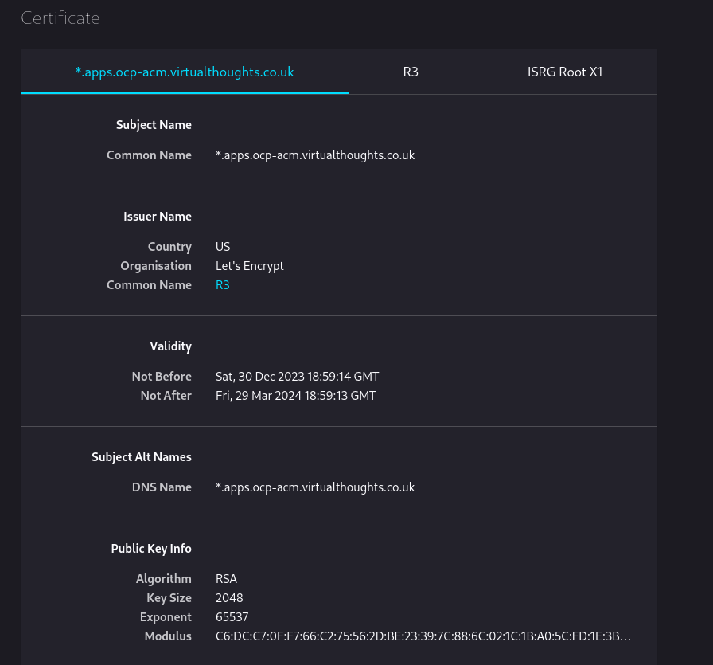

In a standard OCP4 installation, several `route` objects are created by default and secured with a internally signed wildcard certificate.

These `routes` are configured as `<app-name>.apps.<domain>`. In my example, I have a cluster with the assigned domain `ocp-acm.virtualthoughts.co.uk`, which results in the `routes` below:

```
oauth-openshift.apps.ocp-acm.virtualthoughts.co.uk
console-openshift-console.apps.ocp-acm.virtualthoughts.co.uk
grafana-openshift-monitoring.apps.ocp-acm.virtualthoughts.co.uk
thanos-querier-openshift-monitoring.apps.ocp-acm.virtualthoughts.co.uk
prometheus-k8s-openshift-monitoring.apps.ocp-acm.virtualthoughts.co.uk
alertmanager-main-openshift-monitoring.apps.ocp-acm.virtualthoughts.co.uk
```

Inspecting `console-openshift-console.apps.ocp-acm.virtualthoughts.co.uk` shows us the default wildcard TLS certificate used by the Ingress Operator:



Because it's internally signed, it's not trusted by default by external clients. However, this can be changed.

## Installing Cert-Manager

`OperatorHub` includes the upstream `cert-manager` chart, as well as one maintained by Red Hat. This can be installed to manage the lifecycle of our new certificate. Navigate to `Operators -> Operator Hub -> cert-manager` and install.



## Create `Secret`, `Issuer` and `Certificate` resources

With Cert-Manager installed, we need to provide configuration so it knows how to issue challenges and generate certificates. In this example:

- `Secret` - A client secret created from my cloud provider for authentication used to satisfy the `challenge` type. In this example AzureDNS, as I'm using the DNS challenge request type to prove ownership of this domain.
- `ClusterIssuer` - A cluster wide configuration that when referenced, determines how to get (issue) certs. You can have multiple Issuers in a cluster, namespace or cluster scoped pointing to different providers and configurations.
- `Certificate` - TLS certs can be generated automatically from ingress annotations, however in this example, it is used to request and store the certificate in its own lifecycle, not tied to a specific `ingress` object.

Let's Encrypt provides wildcard certificates, but only through the DNS-01 challenge. The HTTP-01 challenge cannot be used to issue wildcard certificates. This is reflected in the config:

```yaml
apiVersion: v1
kind: Secret
metadata:
  name: azuredns-config
  namespace: cert-manager
type: Opaque
data:
  client-secret: <Base64 Encoded Secret from Azure>
---
apiVersion: cert-manager.io/v1
kind: ClusterIssuer
metadata:
  name: letsencrypt-production
  namespace: cert-manager
spec:
  acme:
    server: https://acme-v02.api.letsencrypt.org/directory
    email: <email>
    privateKeySecretRef:
      name: letsencrypt
    solvers:
    - dns01:
        azureDNS:
          clientID: <clientID>
          clientSecretSecretRef:
            name: azuredns-config
            key: client-secret
          subscriptionID: <subscriptionID>
          tenantID: <tenantID>
          resourceGroupName: <resourceGroupName>
          hostedZoneName: virtualthoughts.co.uk
          # Azure Cloud Environment, default to AzurePublicCloud
          environment: AzurePublicCloud
---
apiVersion: cert-manager.io/v1
kind: Certificate
metadata:
  name: wildcard-apps-certificate
  namespace: openshift-ingress
spec:
  secretName: apps-wildcard-tls
  issuerRef:
    name: letsencrypt-production
    kind: ClusterIssuer
  commonName: "*.apps.ocp-acm.virtualthoughts.co.uk"
  dnsNames:
  - "*.apps.ocp-acm.virtualthoughts.co.uk"
```

Applying the above will create the respective objects required for us to request, receive and store a wildcard certificate from LetsEncrypt, using the DNS challenge request with AzureDNS.

The certificate may take ~2mins or so to become `Ready` due to the nature of the DNS style challenge.

```bash
oc get cert -A

NAMESPACE           NAME                        READY   SECRET              AGE
openshift-ingress   wildcard-apps-certificate   True    apps-wildcard-tls   33m
```

## Patch the Ingress Operator

With the certificate object created, the Ingress Operator needs re configuring, referencing the secret name of the `certificate` object for our new certificate:

```bash
oc patch ingresscontroller.operator default \
--type=merge -p \
'{"spec":{"defaultCertificate":{"name":"apps-wildcard-tls"}}}' \
--namespace=openshift-ingress-operator
```

## Validate

After applying, navigating back to the clusters console will present the new wildcard cert:




