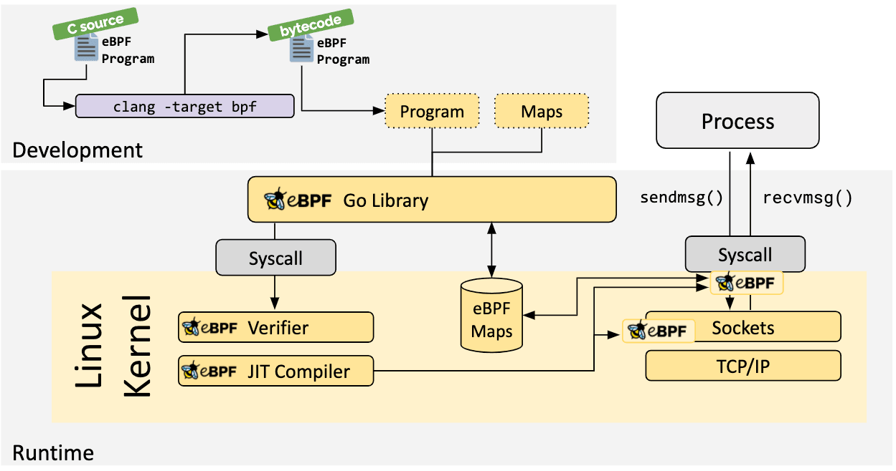

[Part 1](https://www.virtualthoughts.co.uk/2024/01/24/diving-into-an-ebpf-go-example-part-1/) / [Part 2](https://www.virtualthoughts.co.uk/2024/01/23/diving-into-an-ebpf-go-example-part-2/) / [Part 3](https://www.virtualthoughts.co.uk/2024/01/24/diving-into-an-ebpf-go-example-part-3-bonus-round/)

In Part 1, we had a look at creating the eBPF program in C, which we will need to compile into eBPF bytecode and inject into our Go application



Rather than copy/paste the exact instructions, the [ebpf-go](https://ebpf-go.dev/guides/getting-started/#compile-ebpf-c-and-generate-scaffolding-using-bpf2go) documentation outlines the process in the toolchain to create the scaffolding for the Go application.

```cpp
package main

import (
    "log"
    "net"
    "os"
    "os/signal"
    "time"

    "github.com/cilium/ebpf/link"
    "github.com/cilium/ebpf/rlimit"
)

func main() {
    // Remove resource limits for kernels <5.11.
    if err := rlimit.RemoveMemlock(); err != nil { 
        log.Fatal("Removing memlock:", err)
    }

    // Load the compiled eBPF ELF and load it into the kernel.
    var objs counterObjects 
    if err := loadCounterObjects(&objs, nil); err != nil {
        log.Fatal("Loading eBPF objects:", err)
    }
    defer objs.Close() 

    ifname := "eth0" // Change this to an interface on your machine.
    iface, err := net.InterfaceByName(ifname)
    if err != nil {
        log.Fatalf("Getting interface %s: %s", ifname, err)
    }

    // Attach count_packets to the network interface.
    link, err := link.AttachXDP(link.XDPOptions{ 
        Program:   objs.CountPackets,
        Interface: iface.Index,
    })
    if err != nil {
        log.Fatal("Attaching XDP:", err)
    }
    defer link.Close() 

    log.Printf("Counting incoming packets on %s..", ifname)

    // Periodically fetch the packet counter from PktCount,
    // exit the program when interrupted.
    tick := time.Tick(time.Second)
    stop := make(chan os.Signal, 5)
    signal.Notify(stop, os.Interrupt)
    for {
        select {
        case <-tick:
            var count uint64
            err := objs.PktCount.Lookup(uint32(0), &count) 
            if err != nil {
                log.Fatal("Map lookup:", err)
            }
            log.Printf("Received %d packets", count)
        case <-stop:
            log.Print("Received signal, exiting..")
            return
        }
    }
}
```

As there's already an example, let's dig into the prominent sections:

```cpp
    // Load the compiled eBPF ELF and load it into the kernel.
    var objs counterObjects 
    if err := loadCounterObjects(&objs, nil); err != nil {
        log.Fatal("Loading eBPF objects:", err)
    }
    defer objs.Close() 

    ifname := "eth0" // Change this to an interface on your machine.
    iface, err := net.InterfaceByName(ifname)
    if err != nil {
        log.Fatalf("Getting interface %s: %s", ifname, err)
    }

    // Attach count_packets to the network interface.
    link, err := link.AttachXDP(link.XDPOptions{ 
        Program:   objs.CountPackets,
        Interface: iface.Index,
    })
    if err != nil {
        log.Fatal("Attaching XDP:", err)
    }
    defer link.Close() 
```

`counterObjects` : This is a struct type generated by running `bpf2go`, representing our compiled eBPF ELF.

`loadCounterObjects()` : Attempts to load the eBPF object, and captures an error if it cannot do so.

`defer objs.Close()` : Ensure proper cleanup of any resources associated with the loaded eBPF objects on exit. This is a common practice to prevent resource leaks.

`link.AttachXDP`: This function call is used to attach an XDP program to a specific network device. The `Program` being our C-based eBPF Program we defined as `CountPackets`:

```cpp
// From counter.c

SEC("xdp") 
int count_packets() {
```

Finally, we need a way of fetching data from the eBPF map storing our Packet counter:

```cpp
  // Periodically fetch the packet counter from PktCount,
    // exit the program when interrupted.
    tick := time.Tick(time.Second)
    stop := make(chan os.Signal, 5)
    signal.Notify(stop, os.Interrupt)
    for {
        select {
        case <-tick:
            var count uint64
            err := objs.PktCount.Lookup(uint32(0), &count) 
            if err != nil {
                log.Fatal("Map lookup:", err)
            }
            log.Printf("Received %d packets", count)
        case <-stop:
            log.Print("Received signal, exiting..")
            return
        }
    }
```

Here, we leverage two channels, one that will loop indefinitely, printing out the `value` in the first index of the `map`, (the packet counter) and a second channel that will quit the application in the event of a termination signal from the Operating System.

[Part 1](https://www.virtualthoughts.co.uk/2024/01/24/diving-into-an-ebpf-go-example-part-1/) / [Part 2](https://www.virtualthoughts.co.uk/2024/01/23/diving-into-an-ebpf-go-example-part-2/) / [Part 3](https://www.virtualthoughts.co.uk/2024/01/24/diving-into-an-ebpf-go-example-part-3-bonus-round/)
