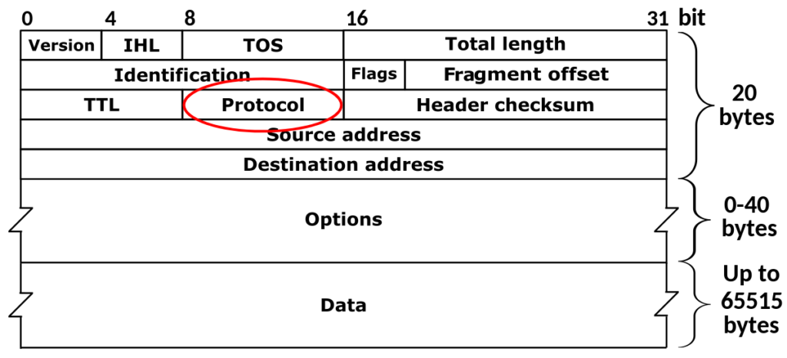

[Part 1](https://www.virtualthoughts.co.uk/2024/01/24/diving-into-an-ebpf-go-example-part-1/) / [Part 2](https://www.virtualthoughts.co.uk/2024/01/23/diving-into-an-ebpf-go-example-part-2/) / [Part 3](https://www.virtualthoughts.co.uk/2024/01/24/diving-into-an-ebpf-go-example-part-3-bonus-round/)

With one example explored, I wanted to put a spin on it - Therefore, I had an idea:

_"Can I use eBPF to identify and store the contents of the `protocol` header for IP packets on a specific interface?"_



It's more of a rhetorical question - of course we can! The code can be found [here](https://github.com/David-VTUK/eBPF-Frolics/tree/main/layer4).

To summarise, the eBPF C program is a little more complicated. It still leverages XDP, however instead of counting the number of packets, it will inspect each IP packet, extract the [protocol number](https://en.wikipedia.org/wiki/List_of_IP_protocol_numbers), and store it in a map.

```cpp
#include <linux/bpf.h>
#include <bpf/bpf_helpers.h>
#include <linux/if_ether.h>
#include <linux/ip.h>

struct {
    __uint(type, BPF_MAP_TYPE_ARRAY); 
    __type(key, __u32);
    __type(value, __u64);
    __uint(max_entries, 255);
} protocol_count SEC(".maps"); 

SEC("xdp")
int get_packet_protocol(struct xdp_md *ctx) {
    void *data_end = (void *)(long)ctx->data_end;
    void *data = (void *)(long)ctx->data;

    // Parse Ethernet header
    struct ethhdr *eth = data;
    if ((void *)(eth + 1) > data_end) {
        return XDP_PASS;
    }

    // Check if the packet is an IP packet
    if (eth->h_proto != __constant_htons(ETH_P_IP)) {
        return XDP_PASS;
    }

    // Parse IP header
    struct iphdr *ip = data + sizeof(struct ethhdr);
    if ((void *)(ip + 1) > data_end) {
        return XDP_PASS;
    }
    
    __u32 key = ip->protocol; // Using IP protocol as the key
    __u64 *count = bpf_map_lookup_elem(&protocol_count, &key);
    if (count) {
        __sync_fetch_and_add(count, 1);
    }

    return XDP_PASS;
}

```

The Go application is over 100 lines, therefore for brevity, it can be viewed [here](https://github.com/David-VTUK/eBPF-Frolics/blob/main/packetProtocol/main.go).

The eBPF map to store this could be visualised as:

```
+----------------------------------------------------+
|                 eBPF Array Map                      |
|                                                    |
|  +------+  +------+  +------+  +------+  +------+  |
|  |  0   |  |  1   |  |  2   |  |  ... |  | 254  |  |
|  |------|  |------|  |------|  |------|  |------|  |
|  |  ?   |  |  ?   |  |  ?   |  |  ... |  |  ?   |  |
|  +------+  +------+  +------+  +------+  +------+  |
|                                                    |
+----------------------------------------------------+

```

Where the `Key` represents the [IP protocol number](https://en.wikipedia.org/wiki/List_of_IP_protocol_numbers) and `value` counting the number of instances.

The Go application leverages a helper function to map the protocol number to name in `stdout`.

Running the application probes the map and outputs non-zero values and their corresponding key. It can be easily tested by running the app and generating traffic. Note how after executing `ping` the map updates with ICMP traffic.

[Part 1](https://www.virtualthoughts.co.uk/2024/01/24/diving-into-an-ebpf-go-example-part-1/) / [Part 2](https://www.virtualthoughts.co.uk/2024/01/23/diving-into-an-ebpf-go-example-part-2/) / [Part 3](https://www.virtualthoughts.co.uk/2024/01/24/diving-into-an-ebpf-go-example-part-3-bonus-round/)
