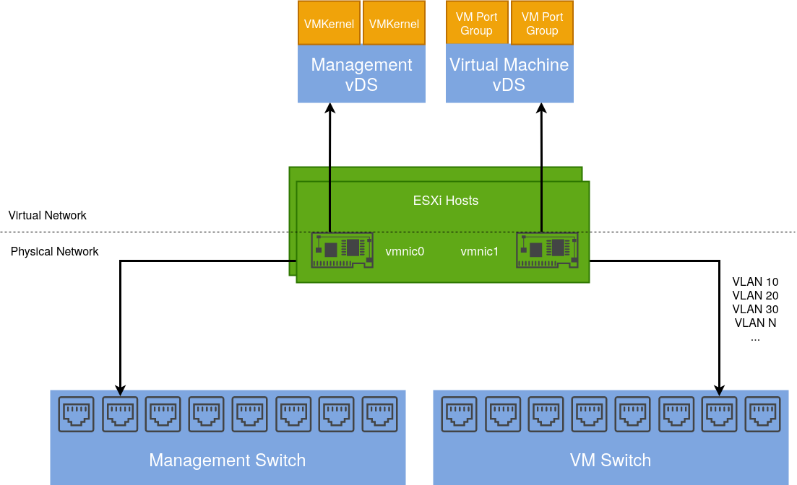
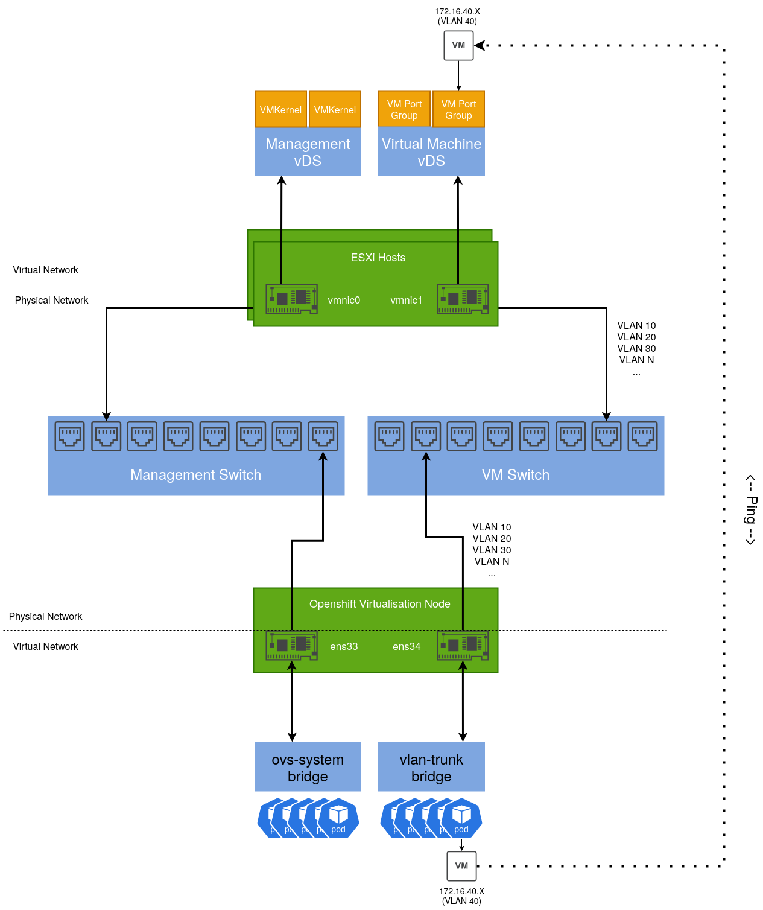
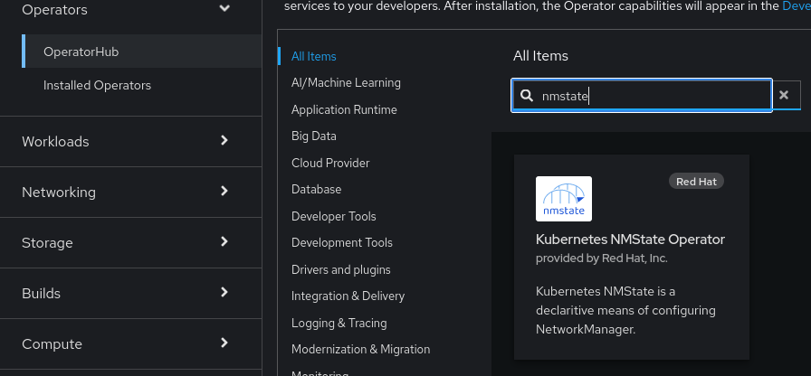
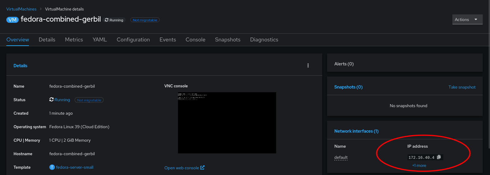

[Red Hat Openshift Virtualisation](https://www.redhat.com/en/technologies/cloud-computing/openshift/virtualization) provides a platform for running and managing Virtual Machines alongside Containers using a consistent API. It also provides a mechanism for migrating VMs from platforms such as vSphere.

As I have both environments, I wanted to deploy an Openshift Virtualisation setup that mimics my current vSphere setup so I could migrate Virtual Machines to it.

## Existing vSphere Design

Below is a diagram depicting my current vSphere setup. My ESXi hosts are dual-homed with a separation of management (vmkernel) and virtual machine traffic.

`vmnic1` is connected to a trunk port accommodating several different VLANs. These are configured as corresponding port groups in the Distributed Switch.



## Integrating an Openshift Virtualisation host

Given an Openshift host with the same number of NICs, we can design a similar solution including a test use case:



By default, an existing bridge (`ovs-system`) is created by Openshift to facilitate cluster networking. To achieve the same level of isolation configured in the vSphere environment, an additional bridge is required. This will be called `vlan-trunk` and as the name implies, it will act as a trunk interface for a range of VLAN networks.

Once configured, a `Virtual Machine Instance` can be created, connected to one of these VLAN networks and reside on the same L2 network as their vSphere-managed VM counterparts.

## Configuring the Openshift Node

There are several ways to accomplish this, however for ease, the `NMState` Operator can be used to configure host networking in a declarative way:



Once installed, a default `NMState` object needs to be created:

```yaml
apiVersion: nmstate.io/v1
kind: NMState
metadata:
  name: nmstate
spec: {}
```

After which we can define an instance of the `NodeNetworkConfigurationPolicy` object that creates our additional bridge interface and includes a specific NIC.

```yaml
apiVersion: nmstate.io/v1
kind: NodeNetworkConfigurationPolicy
metadata:
  name: vlan-trunk-ens34-policy
spec:
  desiredState:
    interfaces:
      - name: vlan-trunk
        description: Linux bridge with ens34 as a port
        type: linux-bridge
        state: up
        ipv4:
          enabled: false
        bridge:
          options:
            stp:
              enabled: false
          port:
            - name: ens34
```

To validate, run `ip addr show` on the host:

```bash
2: ens33: <BROADCAST,MULTICAST,ALLMULTI,UP,LOWER_UP> mtu 1500 qdisc mq master ovs-system state UP group default qlen 1000
    link/ether 00:50:56:bb:e3:c3 brd ff:ff:ff:ff:ff:ff
    altname enp2s1
3: ens34: <BROADCAST,MULTICAST,UP,LOWER_UP> mtu 1500 qdisc mq master vlan-trunk state UP group default qlen 1000
    link/ether 00:50:56:bb:97:0d brd ff:ff:ff:ff:ff:ff
    altname enp2s2

...

653: vlan-trunk: <BROADCAST,MULTICAST,UP,LOWER_UP> mtu 1500 qdisc noqueue state UP group default qlen 1000
    link/ether 00:50:56:bb:97:0d brd ff:ff:ff:ff:ff:ff
```

In a similar way that `Distributed Port groups` are created in vSphere, we can create `NetworkAttachmentDefinition` objects that represent our physical network(s) in software.

The example below is comparable to a `Distributed Port Group` in vSphere that's configured to tag traffic with the VLAN ID of 40. If required, we could repeat this process for each VLAN/Distributed Port group so we have a 1:1 mapping between both the vSphere and Openshift Virtualisation environments.

```yaml
apiVersion: k8s.cni.cncf.io/v1
kind: NetworkAttachmentDefinition
metadata:
  annotations:
    k8s.v1.cni.cncf.io/resourceName: bridge.network.kubevirt.io/vlan-trunk
  name: vm-vlan-40
  namespace: openshift-nmstate
spec:
  config: '{"name":"vm-vlan-40","type":"cnv-bridge","cniVersion":"0.3.1","bridge":"vlan-trunk","vlan":40,"macspoofchk":true,"ipam":{},"preserveDefaultVlan":false}'
```

Which can be referenced when creating a VM:

After a short period, the VM's IP address will be reported to the console. In my example, I have a DHCP server running on that VLAN, which is how this VM acquired its IP address:



Which we can test connectivity from another machine with `ping`. such as a VM running on an ESXi Host:

```bash
sh-5.1# ping 172.16.40.4
PING 172.16.40.4 (172.16.40.4) 56(84) bytes of data.
64 bytes from 172.16.40.4: icmp_seq=1 ttl=63 time=1.42 ms
64 bytes from 172.16.40.4: icmp_seq=2 ttl=63 time=0.960 ms
64 bytes from 172.16.40.4: icmp_seq=3 ttl=63 time=0.842 ms
64 bytes from 172.16.40.4: icmp_seq=4 ttl=63 time=0.967 ms
64 bytes from 172.16.40.4: icmp_seq=5 ttl=63 time=0.977 ms
```

By taking this approach, we can gradually start migrating VM's from vSphere to Openshift Virtualisation with minimal disruption, which I will cover in a subsequent post.
