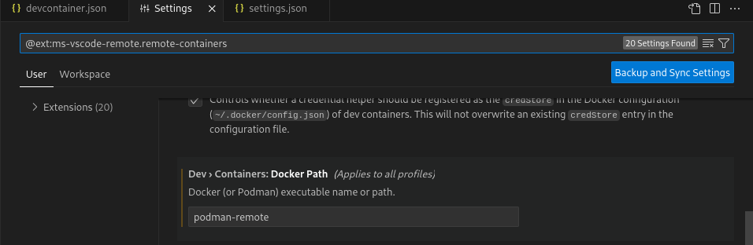
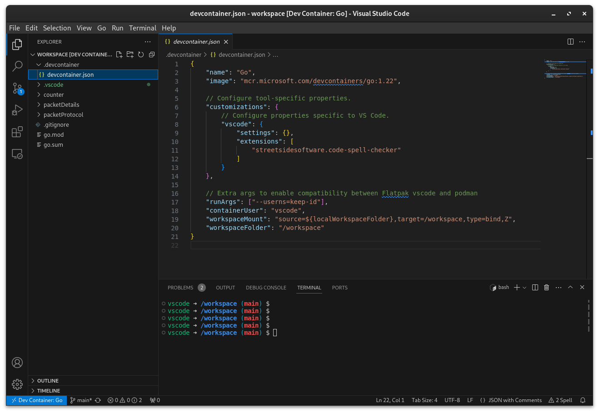

Recently, I've started to embrace Fedora Silverblue (an immutable desktop OS) as my daily driver. One of the issues I encountered was trying to get my vscode (flatpak) to leverage remote containers via `podman` for development.

The following steps are fairly well documented to get started:

1. `flatpak install com.visualstudio.code`

3. `flatpak install com.visualstudio.code.tool.podman`

5. Set `"dev.containers.dockerPath": "podman-remote"` in VSCode settings/json:



However, these following (mandatory) steps took a bit more digging around. In a repo's `.devcontainer.json` file, add:

```java
// Extra args to enable compatibility between Flatpak vscode and podman
"runArgs": ["--userns=keep-id"],
"containerUser": "vscode",
"workspaceMount": "source=${localWorkspaceFolder},target=/workspace,type=bind,Z",
"workspaceFolder": "/workspace"
```



Without doing so, I found my dev container attempting to mount the workspace incorrectly, resulting in a empty workspace view.
