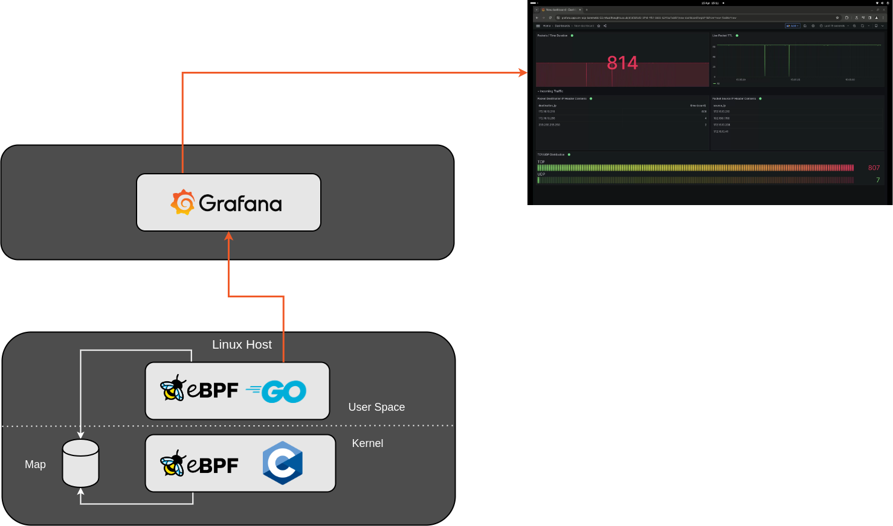

Code Repo for this post can be found [here](https://github.com/David-VTUK/ebpf-grafana-stream).

[Grafana Live](https://grafana.com/docs/grafana/latest/setup-grafana/set-up-grafana-live/) is a real-time messaging engine built into Grafana v8 and onwards, designed to support real-time data streaming and updates. It allows data to be pushed to objects such as dashboard panels directly from the source. One of the benefits being near instant updates and no need to perform periodic refreshes.

Having experimented with eBPF recently, I thought this would be a neat thing to pair up - High performance packet analysis provided by Express Data Path (XDP), with instant visualisation provided by Grafana



The app consists of two parts - the C-based eBPF application that hooks into XDP, and a Go based application running in User space. The two share information by leveraging an eBPF map, in this example a Ring Buffer.

The eBPF C application is written in such a way to extract key information from incoming packets, and store them into a struct. You could simply pass each packet as-is, but I wanted some practice navigating through different layers and working my way up the OSI model:

```cpp
struct packetDetails
{
    unsigned char l2_src_addr[6];
    unsigned char l2_dst_addr[6];
    unsigned int l3_src_addr;
    unsigned int l3_dst_addr;
    unsigned int l3_protocol;
    unsigned int l3_length;
    unsigned int l3_ttl;
    unsigned int l3_version;
    unsigned int l4_src_port;
    unsigned int l4_dst_port;
};
```

In the Go app, this information is received and formatted before it's sent over to Grafana, including doing some convenient translating to format certain fields like MAC addresses (DEC->HEX) and IP addresses (DEC->String)

```go
	//Convert MAC address from Decimal to HEX
	sourceMacAddress := fmt.Sprintf("%02x:%02x:%02x:%02x:%02x:%02x", packet.L2_src_addr[0], packet.L2_src_addr[1], packet.L2_src_addr[2], packet.L2_src_addr[3], packet.L2_src_addr[4], packet.L2_src_addr[5])
	destinationMacAddress := fmt.Sprintf("%02x:%02x:%02x:%02x:%02x:%02x", packet.L2_dst_addr[0], packet.L2_dst_addr[1], packet.L2_dst_addr[2], packet.L2_dst_addr[3], packet.L2_dst_addr[4], packet.L2_dst_addr[5])

	//Convert IP address from Decimal to IPv4
	sourceIP := net.IPv4(byte(packet.L3_src_addr), byte(packet.L3_src_addr>>8), byte(packet.L3_src_addr>>16), byte(packet.L3_src_addr>>24)).String()
	destIP := net.IPv4(byte(packet.L3_dst_addr), byte(packet.L3_dst_addr>>8), byte(packet.L3_dst_addr>>16), byte(packet.L3_dst_addr>>24)).String()

	//Convert Protocol number to name
	protocolName := netprotocols.Translate(int(packet.L3_protocol))
```

And employs a simple HTTP call to send this to Grafana:

```go
	//http post to grafana
	req, err := http.NewRequest("POST", grafanaURL, strings.NewReader(telegrafMessage))
	if err != nil {
		log.Printf("Failed to create HTTP request: %v", err)
		return err
	}

	// Add bearer token to the request header
	req.Header.Set("Authorization", "Bearer "+grafanaToken)

	resp, err := http.DefaultClient.Do(req)
	if err != nil {
		log.Printf("Failed to send HTTP request: %v", err)
		return err
	}
```

The Dashboard looks like then when receiving information:

## New Packet, who dis?

As I was testing I noticed some "interesting" traffic being received by my test host, From the video it shows a number of destination IP's extracted from IP packets:

- 172.16.10.216 - Sure, expected, this is the IP address of the host I'm running the app on.

- 172.16.10.255 - Again, sure, that's the broadcast address for that VLAN (172.16.10.0/24)

- 239.255.255.250 - Wait, What?

Initially, I thought something was wrong in my code, so I got my Go app to write out the packet details:

```bash
packet_details source_mac="00:11:32:e5:79:5c",destination_mac="01:00:5e:7f:ff:fa",source_ip="172.16.10.208",destination_ip="239.255.255.250",protocol="UDP",length=129i,ttl=1i,version=4i,source_port=50085i,destination_port=1900i
```

This was actually correct - Turns out my NAS (172.16.10.208) was sending out UPnP/SSDP Multicast traffic that my host was understandably receiving. Probably the latter as it's hosting SMB shares. Pretty cool.

It was also why I was seeing some big dips in the live TTL packet feed. These multicast packets have a very low TTL (ie 1). Which makes sense.
