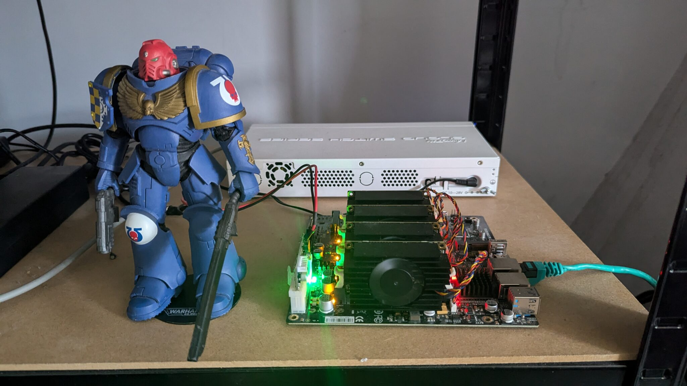
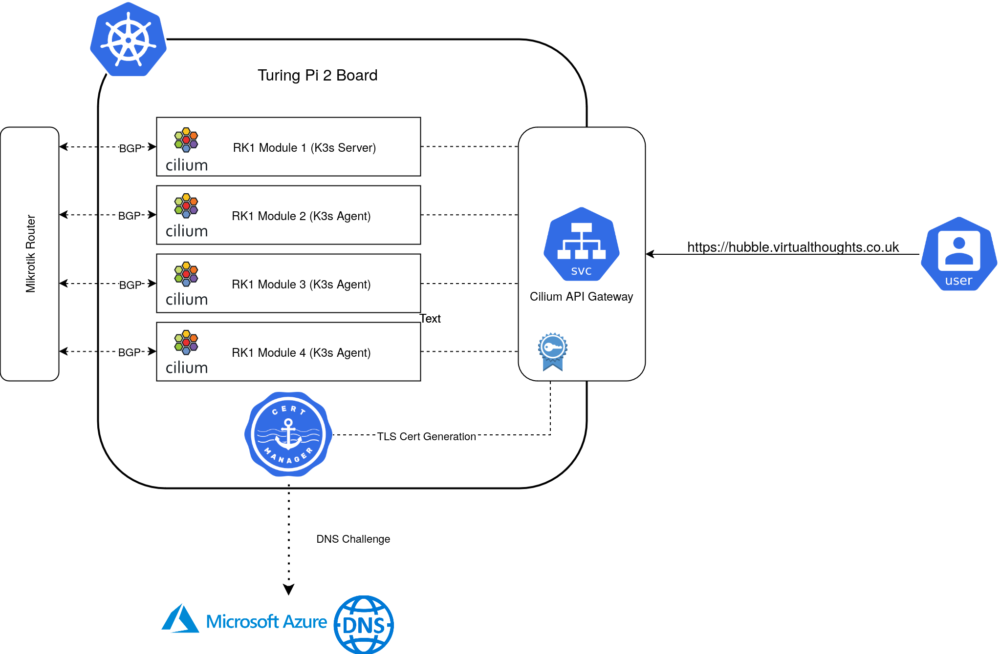
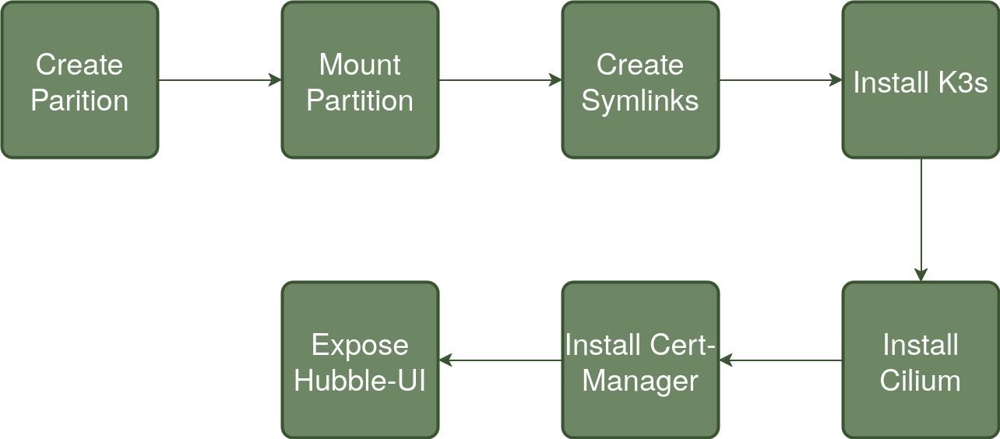
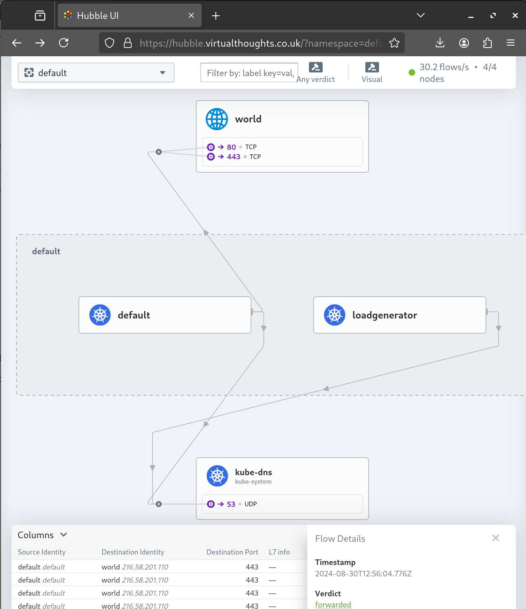
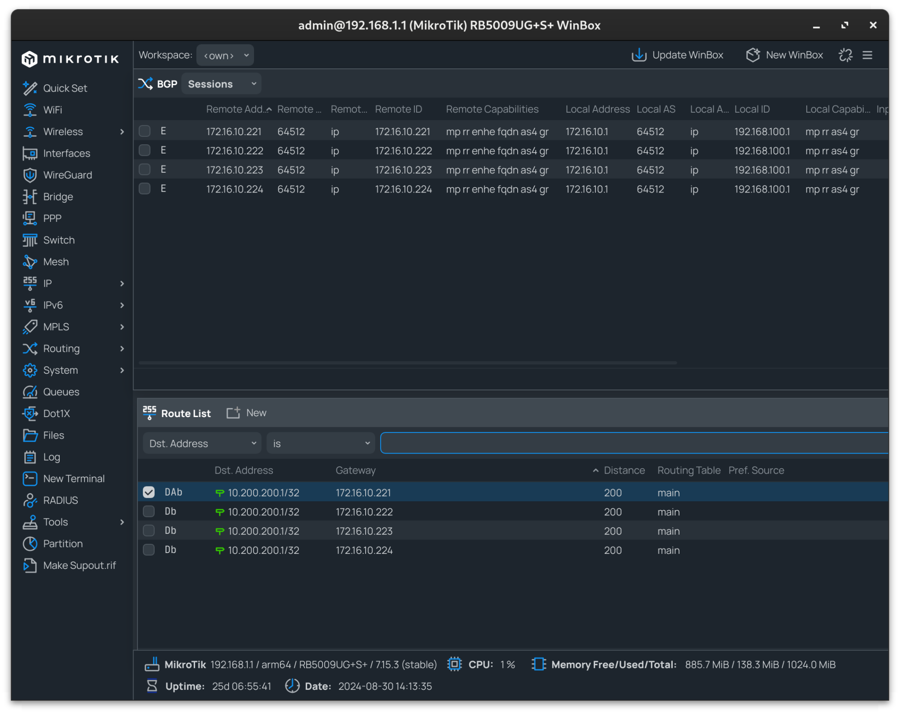

[TLDR: Take me to the Playbook](https://github.com/David-VTUK/turing-pi-ansible)

Note - This is just a high-level overview, I'll likely follow up with a post dedicated on the CIlium/BGP configuration.



I've had my Turing Pi 2 board for a while now, and during that time I've struggled to decide which automation tooling to use to bootstrap K3s to it. However, I reached a decision to use [Ansible](https://www.ansible.com/). It's not something I'm overly familiar with, but this would provide a good opportunity to learn by doing.

The idea is pretty straightforward:



Each RK1 module is fairly well equipped:

- 32GB Ram

- 8 Core CPU

- 512GB NVME SSD

- Pre-Installed with Ubuntu

## Mikrotik Config

Prior to standing up the cluster, the Mikrotik router can be pre-configured to peer with each of the RK1 Nodes, as I did:

```
routing/bgp/connection/ add address-families=ip as=64512 disabled=no local.role=ibgp name=srv-rk1-01 output.default-originate=always remote.address=172.16.10.221 routing-table=main

routing/bgp/connection/ add address-families=ip as=64512 disabled=no local.role=ibgp name=srv-rk1-02 output.default-originate=always remote.address=172.16.10.222 routing-table=main

routing/bgp/connection/ add address-families=ip as=64512 disabled=no local.role=ibgp name=srv-rk1-03 output.default-originate=always remote.address=172.16.10.223 routing-table=main

routing/bgp/connection/ add address-families=ip as=64512 disabled=no local.role=ibgp name=srv-rk1-04 output.default-originate=always remote.address=172.16.10.224 routing-table=main
```

## Workflow

The following represents an overview of the steps [code repo](https://github.com/David-VTUK/turing-pi-ansible)



To summarise each step:

## Create Partition

Each of my RK1 Modules has a dedicated 512GB NVME drive - This will be used for primary Kubernetes storage as well as container storage. The drive is presented as a raw block device and therefore needs partitioning before mounting.

## Mount Partition

The created partition is mounted to /mnt/data and checked.

## Create Symlinks

Three directories are primarily used by K3s/Containerd to store data. Symlinks are created so their contents effectively reside on the NVME drive. These are:

`/run/k3s -> /mnt/data/k3s   /var/lib/kubelet -> /mnt/data/k3s-kubelet   /var/lib/rancher -> /mnt/data/k3s-rancher`

## Install K3s

To facilitate replacing both Kube-Proxy and the default CNI to Cilium's equivalents, a number of flags are passed to the Server install script:

```
--flannel-backend=none
--disable-network-policy
--write-kubeconfig-mode 644
--disable servicelb
--token {{ k3s_token }}
--disable-cloud-controller
--disable local-storage
--disable-kube-proxy
--disable traefik
```

In addition, the `GatewayAPI` CRD's are installed:

```
- name: Apply gateway API CRDs
  kubernetes.core.k8s:
    state: present
    src: https://github.com/kubernetes-sigs/gateway-api/releases/download/v1.1.0/experimental-install.yaml
```

## Install Cilium

Cilium is is customised with the following options enabled:

- BGP Control Plane

- Hubble (Relay and UI)

- GatewayAPI

- BGP configuration to Peer with my Mikrotik router

## Install Cert-Manager

Cert-Manager facilitates certificate generation for exposed services. In my environment, the [API Gateway is annotated](https://cert-manager.io/docs/usage/gateway/) in a way that Cert-Manager will automatically generate a TLS Certificate for, using DNS challenges to Azure DNS.

This also includes the required `clusterIssuer` resource that provides configuration and authentication details

## Expose Hubble-UI

A `gateway` and `httproute` resource is created to expose the Hubble UI:



## Mikrotik BGP Peering Check

Using Winbox, the BGP peering and route propagation can be checked:



In my instance, `10.200.200.1` resolves to my API Gateway IP, with each node advertising this address.
