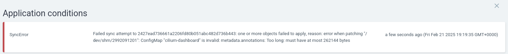
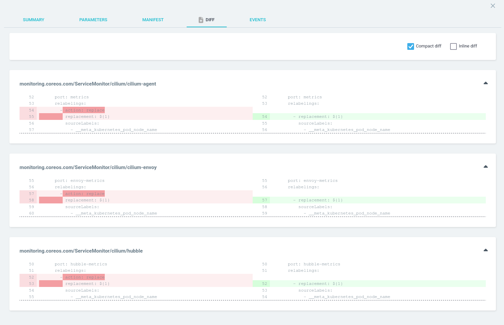

In a recent attempt to automate my homelab cluster ([ref](https://www.virtualthoughts.co.uk/2024/08/30/kubernetes-on-turing-pi-2-automation-with-ansible-cilium-and-cert-manager/)), I now manage all of my cluster applications using ArgoCD, including `cilium`. I also leverage `[applicationSet](https://argo-cd.readthedocs.io/en/stable/user-guide/application-set/)` objects in ArgoCD as an app-of-apps pattern.

After a Cilium update however, it would fail to sync:



One way to address this is to add \`ServerSideApply=true\` to the the resulting application manifest:

```yaml
apiVersion: argoproj.io/v1alpha1
kind: ApplicationSet
metadata:
  name: bootstrap-applications
  namespace: argocd
spec:
  goTemplate: true
  goTemplateOptions: ["missingkey=error"]
  generators:
  - git:
      repoURL: 'https://github.com/David-VTUK/turing-pi-automation.git'
      revision: HEAD
      directories:
      - path: 'argocd-apps/helm-charts/import-from-cluster-standup/*'
  template:
    metadata:
      name: '{{ .path.basename }}'
    spec:
      project: default
      source:
        repoURL: 'https://github.com/David-VTUK/turing-pi-automation.git'
        targetRevision: HEAD
        path: '{{ .path.path }}'
        helm:
          valueFiles:
            - values.yaml
      destination:
        server: 'https://kubernetes.default.svc'
        namespace: '{{ .path.basename }}'
      syncPolicy:
        automated:
          prune: true
          selfHeal: true
        syncOptions:
          - CreateNamespace=true
          - ServerSideApply=true
```

The downside to this, however, is **all** applications from this `applicationset` will inherit this value, which is less than ideal.

## Template Patches

`TemplatePatch` can be used in conjunction with `ApplicationSet` to selectively make changes to the resulting `application` based on specific criteria:

```yaml
# Several lines omitted for brevity
apiVersion: argoproj.io/v1alpha1
kind: ApplicationSet
metadata:
  name: bootstrap-applications
  namespace: argocd
spec:
  template:
  templatePatch: |
    {{ if eq .path.basename "cilium" }}
      spec:
        syncPolicy:
          syncOptions:
            - ServerSideApply=true # required to avoid the "annotations too long error"
            - CreateNamespace=true
    {{- end }}
```

After a resync the previous error is resolved, but Cilium would not be in sync:



Which is noted in a [GitHub issue](https://github.com/cilium/cilium/issues/30755)

To address this, `templatePatch` can be extended to ignore these by leveraging `ignoreDifferences`.

```yaml
# Several lines omitted for brevity
apiVersion: argoproj.io/v1alpha1
kind: ApplicationSet
metadata:
  name: bootstrap-applications
  namespace: argocd
spec:
  template:
  templatePatch: |
    {{ if eq .path.basename "cilium" }}
      spec:
        ignoreDifferences:
        - group: monitoring.coreos.com
          kind: ServiceMonitor
          name: ""
          jsonPointers:
            - /spec
        syncPolicy:
          syncOptions:
            - ServerSideApply=true # required to avoid the "annotations too long error"
            - CreateNamespace=true
    {{- end }}

```
