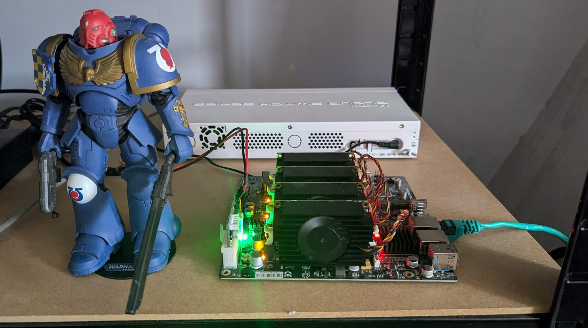
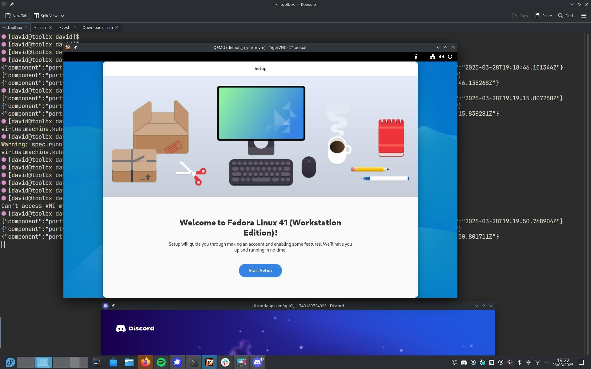

According to the KubeVirt documentation, [CDI is not currently supported on ARM64](https://kubevirt.io/user-guide/cluster_admin/operations_on_Arm64/#containerized-data-importer), which is the architecture my Turing RK1 nodes use.



As a workaround, I experimented with writing an image directly to a PVC which can then be cloned/mounted to a KubeVirt VM. This example `dd's` an ISO image to a PVC:

```yaml
apiVersion: v1
kind: PersistentVolumeClaim
metadata:
  name: fedora-workstation-pvc
spec:
  accessModes:
    - ReadWriteOnce
  resources:
    requests:
      storage: 30Gi
  volumeMode: Block
---
apiVersion: batch/v1
kind: Job
metadata:
  name: upload-fedora-workstation-job
spec:
  template:
    spec:
      containers:
      - name: writer
        image: fedora:latest
        command: ["/bin/bash", "-c"]
        args:
          - |
            set -e
            echo "[1/3] Installing tools..."
            dnf install -y curl xz
            echo "[2/3] Downloading and decompressing Fedora Workstation image..."
            curl -L https://download.fedoraproject.org/pub/fedora/linux/releases/41/Workstation/aarch64/images/Fedora-Workstation-41-1.4.aarch64.raw.xz | xz -d > /tmp/disk.raw
            echo "[3/3] Writing image to PVC block device..."
            dd if=/tmp/disk.raw of=/dev/vda bs=4M status=progress conv=fsync
            echo "Done writing Fedora Workstation image to PVC!"
        volumeDevices:
        - name: disk
          devicePath: /dev/vda
        volumeMounts:
        - name: tmp
          mountPath: /tmp
        securityContext:
          runAsUser: 0
      restartPolicy: Never
      volumes:
      - name: disk
        persistentVolumeClaim:
          claimName: fedora-workstation-pvc
      - name: tmp
        emptyDir: {}
```

Which can then be mounted to a VM:

```yaml
apiVersion: kubevirt.io/v1
kind: VirtualMachine
metadata:
  name: my-arm-vm
spec:
  running: true
  template:
    metadata:
      labels:
        kubevirt.io/domain: my-arm-vm
    spec:
      domain:
        cpu:
          cores: 2
        resources:
          requests:
            memory: 2Gi
        devices:
          disks:
            - name: disk0
              disk:
                bus: virtio
      volumes:
        - name: disk0
          persistentVolumeClaim:
            claimName: fedora-workstation-pvc
```


