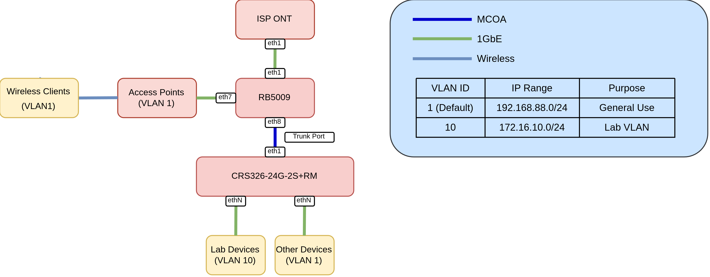
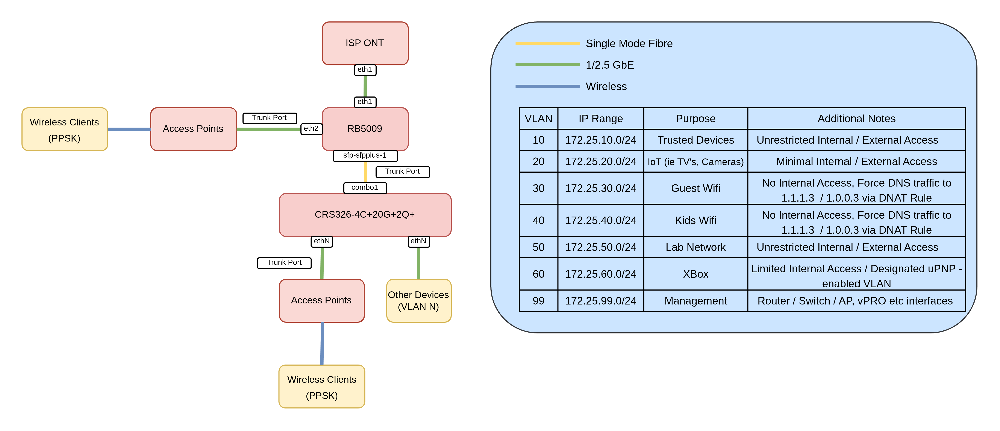
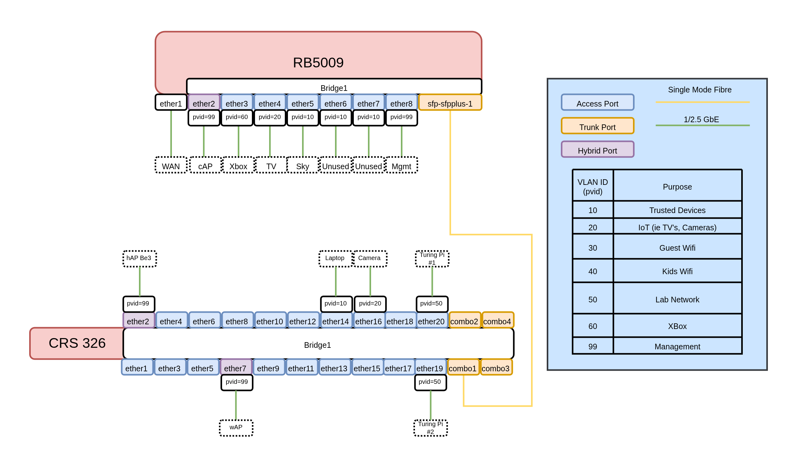

Having built an extension and lined the walls with as much Cat6a as I could get my hands on, together with anticipating future needs for kids devices I've decided to revisit my networking setup.

## Existing Setup



The existing setup is pretty straightforward - a RB5009 providing Routing, Firewalling, DHCP and DNS services with some devices directly attached. A trunk port carries default and Lab (VLAN 10) traffic to a CRS where I have devices connected to either the default VLAN or my Lab VLAN.

The main issues with this setup are devices that I don't necessarily trust - Security cameras, so called "Smart" Devices, TV's etc all reside on the default VLAN. Time to change that.

## Bill of Materials

Having 16 new cat6a ports dotted around my house gave me an excuse to upgrade my setup somewhat. 

* 1x [RB5009](https://mikrotik.com/product/rb5009ug_s_in) - Repurposed, still performs excellently  
* 1x [CRS326-4C+20G+2Q+](https://mikrotik.com/product/crs326_4c_20g_2q_rm) - Main switch  
* 1x [hAP be³ Media](https://mikrotik.com/product/hap_be3_media) - Although a capable router, I'll be using this as a glorified switch and AP combo for my new living room, providing wireless and wired connectivity.
* 1x [30M outdoor 4 fibre LC UPC to LC UPC Single Mode OS2 Fibre Cable](https://www.fs.com/uk/products/70220.html)  
  * 4 Fibres to add additional connectivity options further down the line.
* 2x [MikroTik S+31DLC10D Compatible 10GBASE-LR SFP+ 1310nm 10km Duplex LC/UPC SMF Transceiver Modules](https://www.fs.com/uk/products/230697.html)
* 1x [wAP AX](https://mikrotik.com/product/wap_ax) - Upstairs Wireless (Office)
* 1x [cAP AX](https://mikrotik.com/product/cap_ax) - Replace Unifi u6 lite the other end of the house.

## Revised Diagram

To address the discrepancies of the previous design I've decided to incorporate a number of changes:



## VLAN all the Things

This yields two main benefits:

* **Makes Firewall rules easier to manage** - Ie I can leverage MikroTik's `interface lists` to isolate subnets.
* **Enables the use of PPSK** - A single SSID can be leveraged that, depending on the passphrase used, will land clients on a specific VLAN.

To fully utilise this, the `bridge` needs to be configured with vlan filtering enabled:

```bash
/interface bridge
add frame-types=admit-only-vlan-tagged name=bridge1 vlan-filtering=yes
```

`vlan-filtering=yes` effectively changes the MikroTik bridge from a unmanaged "dumb" switch into a managed "smart" switch that actively checks, modifies and enforces VLAN tagging and dropping other traffic.

## `frame-types` options

`frame-types=admit-all` allows tagged and untagged frames to enter the interface. This is required for `hybrid` ports (more on that later)

`frame-types=admit-only-vlan-tagged` only allows incoming Ethernet frames containing a VLAN tag to enter the port. This is typically used for `trunk` ports.

`frame-types=admit-only-untagged-and-priority-tagged` enforces access port behavior by dropping any incoming traffic that doesn't have a 802.1Q VLAN tag. This is typically used for `access` ports.

`frame-types` can be applied at both the `bridge` (CPU) and `port` level

At the Bridge level : For traffic passing from the bridge switch fabric into the RouterOS CPU.

At a Port Level: For traffic entering physical/member interfaces (`ether1`, etc.) from external devices.

## CRS326 Config

### Access Ports

An access port is a switch port configured to carry traffic for only a single VLAN. It is designed to connect end-user devices that do not process or are aware of 802.1Q VLAN tags, but we want them the traffic to reside within a specific VLAN.

These are pretty straightforward to configure in RouterOS. For example below I have:

* A Reolink camera on VLAN 20 (IoT / Untrusted)
* NAS on VLAN 10 (Trusted)
* 2x Turing Pi Interfaces on VLAN 50 (Lab Network)

```bash
add bridge=bridge1 comment="Reolink Camera" frame-types=admit-only-untagged-and-priority-tagged interface=ether17 pvid=20
add bridge=bridge1 comment=NAS frame-types=admit-only-untagged-and-priority-tagged interface=ether18 pvid=10
add bridge=bridge1 comment="Turing Pi #1" frame-types=admit-only-untagged-and-priority-tagged interface=ether19 pvid=50
add bridge=bridge1 comment="Turing Pi #2" frame-types=admit-only-untagged-and-priority-tagged interface=ether20 pvid=50
```

### Hybrid Ports

A hybrid port is a switch port configured to carry both untagged traffic for one specific VLAN and tagged traffic for one or more other VLANs over the same physical cable.

For my access points (connected to `ether2` and `ether7`) the configuration is as follows

* Untagged traffic will reside on `VLAN99` (management vlan).
* Tagged traffic will be passed as-is.

This means as soon I as I plug in a access point and set the PVID to 99 on the bridge port, it will be accessible in that VLAN. This makes provisioning easier as out-of-the-box, the device will be accessible (assuming DHCP is enabled etc)

```bash
/interface bridge port
add bridge=bridge1 interface=ether2 pvid=99
add bridge=bridge1 interface=ether7 pvid=99
```

### Trunk Ports

My CRS does not do any L3 or higher level services, this will be handled by the RB5009. Therefore, the trunk port is configured to retain the VLAN tags:

> [!NOTE]
> On the CRS326 the 4x SFP+ ports and the final 4 2.5GbE ports act as combo ports, hence the naming convention. You can use either, but not both.

```bash {hl_lines=[2]}
/interface bridge vlan
add bridge=bridge1 tagged=bridge1,combo1 vlan-ids=99
add bridge=bridge1 tagged=combo1,ether2,ether7 vlan-ids=10
add bridge=bridge1 tagged=combo1,ether2,ether7 vlan-ids=20
add bridge=bridge1 tagged=combo1,ether2,ether7 vlan-ids=30
add bridge=bridge1 tagged=combo1,ether2,ether7 vlan-ids=40
add bridge=bridge1 tagged=combo1,ether2,ether7 vlan-ids=50
add bridge=bridge1 tagged=combo1,ether2,ether7 vlan-ids=60
```

> [!NOTE]
> VLAN 99 is tagged on the `bridge` as this is the management IP of the device. In RouterOS, if we want the CPU to "talk" on a specific VLAN, it must be tagged on the `bridge` interface. This will enable us to, for example, SSH, Winbox, Ping etc to a sub interface on this VLAN.
>
> For the RB5009 we will be tagging the `bridge` with VLANS to provide DHCP, DNS, Firewall and other services.

## RB5009 Config

To reflect this configuring on the other side of the trunk:

```bash
/interface bridge
add frame-types=admit-only-vlan-tagged name=bridge1 vlan-filtering=yes
```

### Access Ports:

```bash
/interface bridge port
add bridge=bridge1 frame-types=admit-only-untagged-and-priority-tagged interface=ether3 pvid=60
add bridge=bridge1 frame-types=admit-only-untagged-and-priority-tagged interface=ether4 pvid=20
add bridge=bridge1 frame-types=admit-only-untagged-and-priority-tagged interface=ether5 pvid=10
add bridge=bridge1 frame-types=admit-only-untagged-and-priority-tagged interface=ether6 pvid=10
add bridge=bridge1 frame-types=admit-only-untagged-and-priority-tagged interface=ether7 pvid=10
add bridge=bridge1 frame-types=admit-only-untagged-and-priority-tagged interface=ether8 pvid=99
add bridge=bridge1 frame-types=admit-only-vlan-tagged interface=sfp-sfpplus1
```

### Hybrid Ports

`ether2` is where my cAP AX is plugged into, and therefore acts as a hybrid port, untagged traffic will be tagged with VLAN 99:

```bash
add bridge=bridge1 interface=ether2 pvid=99
```

### Trunk Ports

```bash
/interface bridge vlan
add bridge=bridge1 tagged=bridge1,sfp-sfpplus1,ether2 vlan-ids=10
add bridge=bridge1 tagged=bridge1,ether2,sfp-sfpplus1 vlan-ids=20
add bridge=bridge1 tagged=bridge1,ether2,sfp-sfpplus1 vlan-ids=30
add bridge=bridge1 tagged=bridge1,ether2,sfp-sfpplus1 vlan-ids=40
add bridge=bridge1 tagged=bridge1,ether2,sfp-sfpplus1 vlan-ids=50
add bridge=bridge1 tagged=bridge1,sfp-sfpplus1 vlan-ids=99
add bridge=bridge1 tagged=bridge1,sfp-sfpplus1 vlan-ids=60
```

> [!NOTE]
> In contrast to the CRS config, the VLANs are tagged to the `Bridge` interface too. This is required as the RB5009 will be providing DNS, DHCP, Firewall and other services for those VLANs, and therefore needs to be connected to the CPU

To summarise:

* `ether1` is not part of the bridge, acting as a dedicated WAN port.
* `ether2` is a Hybrid Port, untagged traffic will be placed on VLAN 99 (management) and will forward already-tagged VLAN-aware traffic.
* `ether2-ether8` are Access Ports, egress traffic will automatically have the VLAN ID injected into the Ethernet frames. Consequently, those devices will reside on that specific VLAN.


## Low Level Diagram



## Summarised Configs

Below are config excerpts from both devices capturing the L2 config: 

## CRS326
```bash
# model = CRS326-4C+20G+2Q+
/interface bridge
add frame-types=admit-only-vlan-tagged name=bridge1 vlan-filtering=yes
/interface ethernet
set [ find default-name=combo1 ] advertise="10M-baseT-half,10M-baseT-full,100M\
    -baseT-half,100M-baseT-full,1G-baseT-full,1G-baseX,2.5G-baseT,2.5G-baseX,1\
    0G-baseSR-LR,10G-baseCR"
set [ find default-name=combo2 ] advertise="10M-baseT-half,10M-baseT-full,100M\
    -baseT-half,100M-baseT-full,1G-baseT-full,1G-baseX,2.5G-baseT,2.5G-baseX,1\
    0G-baseSR-LR,10G-baseCR"
set [ find default-name=combo3 ] advertise="10M-baseT-half,10M-baseT-full,100M\
    -baseT-half,100M-baseT-full,1G-baseT-full,1G-baseX,2.5G-baseT,2.5G-baseX,1\
    0G-baseSR-LR,10G-baseCR"
set [ find default-name=combo4 ] advertise="10M-baseT-half,10M-baseT-full,100M\
    -baseT-half,100M-baseT-full,1G-baseT-full,1G-baseX,2.5G-baseT,2.5G-baseX,1\
    0G-baseSR-LR,10G-baseCR"
set [ find default-name=ether21 ] name=mgmt
/interface vlan
add interface=bridge1 name=vlan99-mgmt vlan-id=99
/interface bridge port
add bridge=bridge1 frame-types=admit-only-untagged-and-priority-tagged \
    interface=ether1
add bridge=bridge1 interface=ether2 pvid=99
add bridge=bridge1 frame-types=admit-only-untagged-and-priority-tagged \
    interface=ether3 pvid=99
add bridge=bridge1 frame-types=admit-only-untagged-and-priority-tagged \
    interface=ether4
add bridge=bridge1 frame-types=admit-only-untagged-and-priority-tagged \
    interface=ether5
add bridge=bridge1 frame-types=admit-only-untagged-and-priority-tagged \
    interface=ether6
add bridge=bridge1 interface=ether7 pvid=99
add bridge=bridge1 frame-types=admit-only-untagged-and-priority-tagged \
    interface=ether8
add bridge=bridge1 frame-types=admit-only-untagged-and-priority-tagged \
    interface=ether9
add bridge=bridge1 frame-types=admit-only-untagged-and-priority-tagged \
    interface=ether10
add bridge=bridge1 frame-types=admit-only-untagged-and-priority-tagged \
    interface=ether11
add bridge=bridge1 frame-types=admit-only-untagged-and-priority-tagged \
    interface=ether12
add bridge=bridge1 frame-types=admit-only-untagged-and-priority-tagged \
    interface=ether13
add bridge=bridge1 frame-types=admit-only-untagged-and-priority-tagged \
    interface=ether14 pvid=10
add bridge=bridge1 frame-types=admit-only-untagged-and-priority-tagged \
    interface=ether15
add bridge=bridge1 frame-types=admit-only-untagged-and-priority-tagged \
    interface=ether16
add bridge=bridge1 comment="Reolink Camera" frame-types=\
    admit-only-untagged-and-priority-tagged interface=ether17 pvid=20
add bridge=bridge1 comment=NAS frame-types=\
    admit-only-untagged-and-priority-tagged interface=ether18 pvid=10
add bridge=bridge1 comment="Turing Pi #1" frame-types=\
    admit-only-untagged-and-priority-tagged interface=ether19 pvid=50
add bridge=bridge1 comment="Turing Pi #2" frame-types=\
    admit-only-untagged-and-priority-tagged interface=ether20 pvid=50
add bridge=bridge1 frame-types=admit-only-vlan-tagged interface=combo1
/interface bridge vlan
add bridge=bridge1 tagged=bridge1,combo1 vlan-ids=99
add bridge=bridge1 tagged=combo1,ether2,ether7 vlan-ids=10
add bridge=bridge1 tagged=combo1,ether2,ether7 vlan-ids=20
add bridge=bridge1 tagged=combo1,ether2,ether7 vlan-ids=30
add bridge=bridge1 tagged=combo1,ether2,ether7 vlan-ids=40
add bridge=bridge1 tagged=combo1,ether2,ether7 vlan-ids=50
add bridge=bridge1 tagged=combo1,ether2,ether7 vlan-ids=60
/ip address
add address=172.25.99.2/24 interface=vlan99-mgmt network=172.25.99.0
```

## RB5009

```bash
# model = RB5009UG+S+
/interface bridge
add frame-types=admit-only-vlan-tagged name=bridge1 vlan-filtering=yes
/interface vlan
add interface=bridge1 name=vlan10-trusted vlan-id=10
add interface=bridge1 mvrp=yes name=vlan20-iot vlan-id=20
add interface=bridge1 name=vlan30-guest-wifi vlan-id=30
add interface=bridge1 name=vlan40-kids-wifi vlan-id=40
add interface=bridge1 name=vlan50-lab-1 vlan-id=50
add interface=bridge1 name=vlan60-xbox vlan-id=60
add interface=bridge1 name=vlan99-mgmt vlan-id=99
/interface bridge port
add bridge=bridge1 interface=ether2 pvid=99
add bridge=bridge1 frame-types=admit-only-untagged-and-priority-tagged \
    interface=ether3 pvid=60
add bridge=bridge1 frame-types=admit-only-untagged-and-priority-tagged \
    interface=ether4 pvid=20
add bridge=bridge1 frame-types=admit-only-untagged-and-priority-tagged \
    interface=ether5 pvid=10
add bridge=bridge1 frame-types=admit-only-untagged-and-priority-tagged \
    interface=ether6 pvid=10
add bridge=bridge1 frame-types=admit-only-untagged-and-priority-tagged \
    interface=ether7 pvid=10
add bridge=bridge1 frame-types=admit-only-untagged-and-priority-tagged \
    interface=ether8 pvid=99
add bridge=bridge1 frame-types=admit-only-vlan-tagged interface=sfp-sfpplus1
/interface bridge vlan
add bridge=bridge1 tagged=bridge1,sfp-sfpplus1,ether2 vlan-ids=10
add bridge=bridge1 tagged=bridge1,ether2,sfp-sfpplus1 vlan-ids=20
add bridge=bridge1 tagged=bridge1,ether2,sfp-sfpplus1 vlan-ids=30
add bridge=bridge1 tagged=bridge1,ether2,sfp-sfpplus1 vlan-ids=40
add bridge=bridge1 tagged=bridge1,ether2,sfp-sfpplus1 vlan-ids=50
add bridge=bridge1 tagged=bridge1,sfp-sfpplus1 vlan-ids=99
add bridge=bridge1 tagged=bridge1,sfp-sfpplus1 vlan-ids=60
```